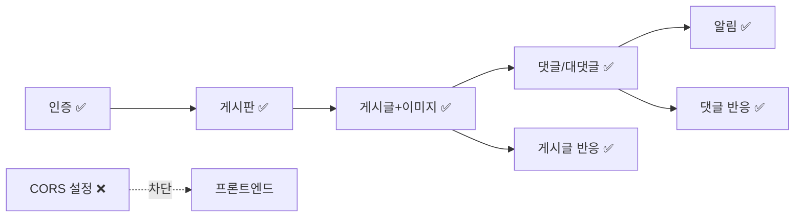

# 🏠 Board Backend Wiki — Home

> SBS Academy 게시판 프로젝트 백엔드.
> Spring Boot 3.5.14 / Java 21 / MySQL / JWT + OAuth2

## 🚀 빠른 진입

| 목적 | 문서 |
|---|---|
| 이 프로젝트가 뭔지 5분 안에 파악 | [[시스템-개요]] |
| 지금 당장 실행해보기 | [[로컬-실행-가이드]] |
| API 전체 목록 한 장 | [[API-개요]] |
| DB 구조 보기 | [[도메인-모델]] |
| **프론트엔드 만들기** | [[프론트엔드-요구사항]] |
| 안 되는 것 / 조심할 것 | [[알려진-이슈]] |
| 반응(좋아요) 동작 방식 | [[API-Reaction]] |

## 🏗 01. 아키텍처

- [[시스템-개요]] — 전체 그림, 요청 흐름
- [[기술-스택]] — 의존성과 버전
- [[패키지-구조]] — 코드가 어디에 있는가
- [[인증-인가-아키텍처]] — JWT · Refresh Token · OAuth2 · 메서드 보안
- [[예외-처리-아키텍처]] — `BusinessException` → `ErrorResponse`
- [[파일-업로드-아키텍처]] — 이미지 저장과 정적 서빙
- [[알림-이벤트-아키텍처]] — `ApplicationEvent` 기반 알림

## 📦 02. 도메인

- [[도메인-모델]] — **ERD 전체도**
- [[엔티티-User]] · [[엔티티-UserProfile]] · [[엔티티-RefreshToken]]
- [[엔티티-Board]] · [[엔티티-Post]] · [[엔티티-PostImage]]
- [[엔티티-Comment]] · [[엔티티-Reaction]] · [[엔티티-Notification]]

## 🔌 03. API

- [[API-개요]] — **엔드포인트 총람 + 권한 매트릭스**
- [[API-Auth]] — 회원가입 / 로그인 / 로그아웃 / 재발급
- [[API-OAuth]] — 카카오 · 구글 소셜 로그인
- [[API-User]] — 내 프로필
- [[API-Board]] — 게시판 CRUD (ADMIN)
- [[API-Post]] — 게시글 CRUD + 이미지 업로드
- [[API-Comment]] — 댓글 · 대댓글
- [[API-Reaction]] — 좋아요 / 싫어요
- [[API-Notification]] — 알림
- [[API-에러코드]] — `ErrorCode` 전체 표
- [[API-페이지네이션]] — `Page<T>` 응답 규격

## 🎨 04. 프론트엔드

- [[프론트엔드-요구사항]] — **기능 요구사항 (FR) 목록**
- [[화면-정의서]] — 라우트 · 화면별 API 매핑
- [[프론트엔드-데이터-모델]] — TypeScript 타입 정의
- [[토큰-저장-전략]] — Access/Refresh 토큰 다루기
- [[API-클라이언트-가이드]] — fetch 래퍼 · 인터셉터 설계

## ⚙️ 05. 운영

- [[로컬-실행-가이드]]
- [[환경변수]]

## 📎 99. 메타

- [[알려진-이슈]] — **버그 · 미구현 · 설계 부채**
- [[용어집]]
- [[Http_Protocol]] — HTTP 기초 정리 (기존 문서)
- [[README]] — 이 Vault의 사용법 · 문서 규칙

---

## 현재 상태 요약

- ✅ 구현 완료 (반응은 등록·조회 모두 동작, N+1 방지 배치 집계 적용)
- ❌ 미구현 / 보류 — [[알려진-이슈]] 참조
