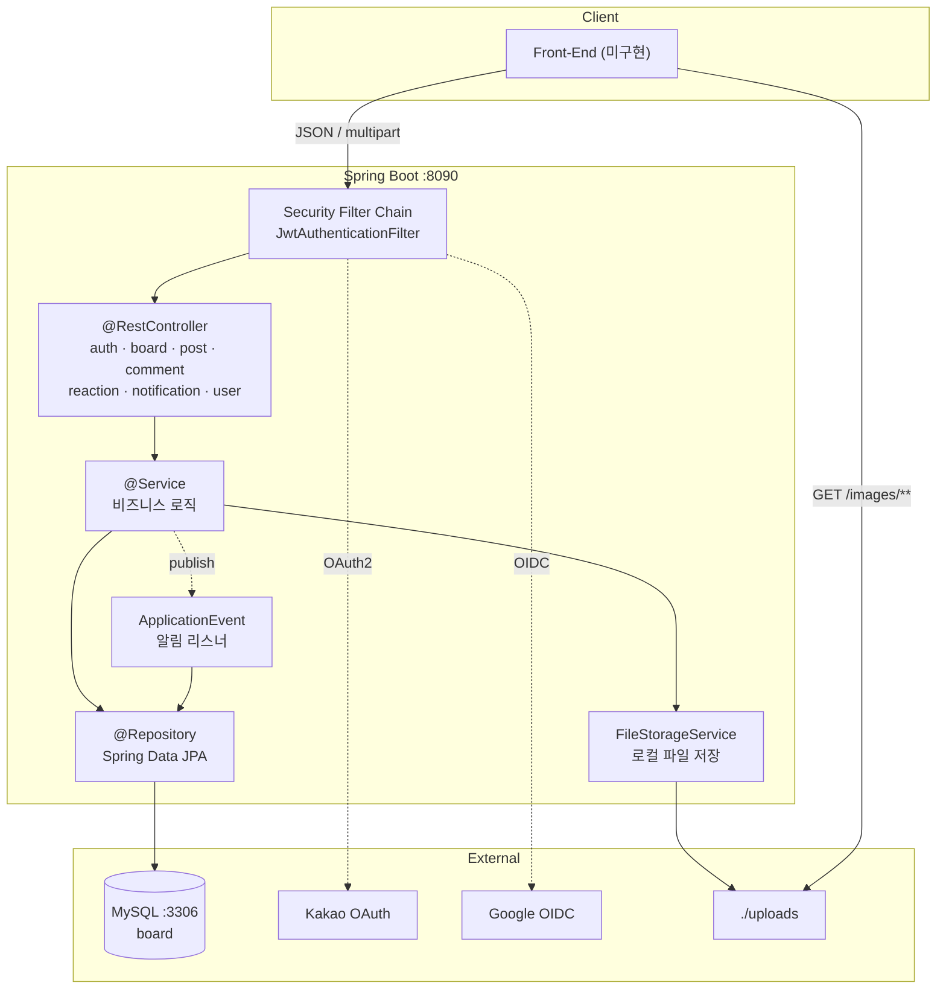
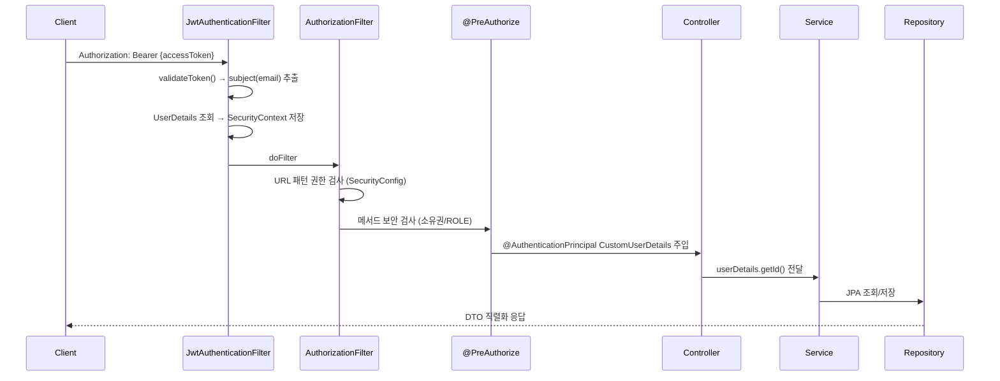
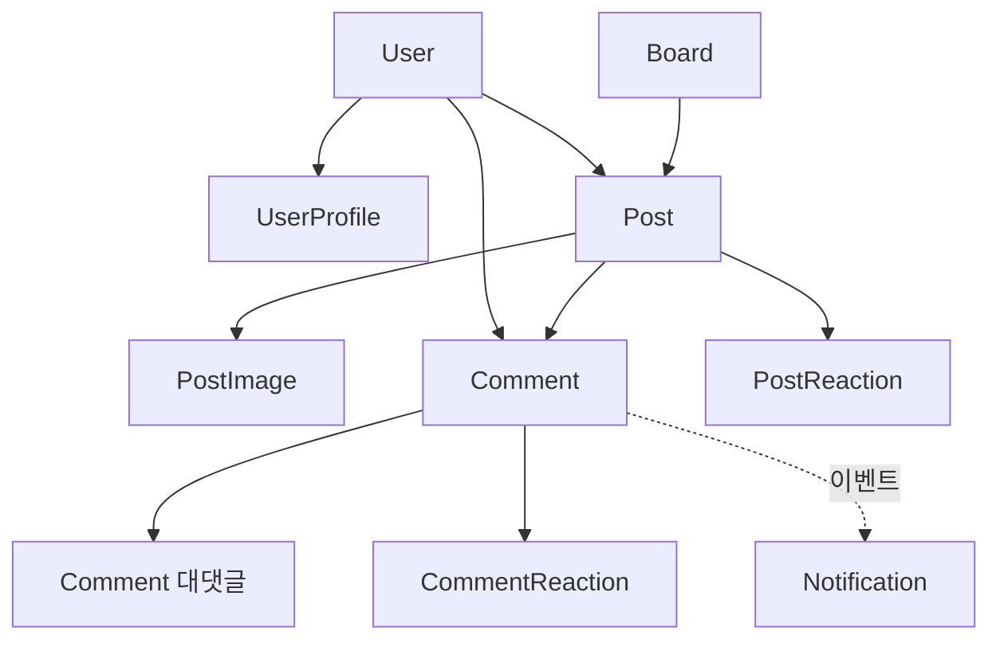

# 시스템 개요

## 한 줄 정의

게시판(Board) → 게시글(Post) → 댓글(Comment) 계층 구조에 **이미지 첨부**, **좋아요/싫어요**, **알림**을 갖춘 REST API 서버.
인증은 **JWT(무상태) + Refresh Token(쿠키)** 이며, **카카오·구글 소셜 로그인**을 지원한다.

- 기본 포트: **8090** (`src/main/resources/application.yaml:2`)
- API 프리픽스: `/api`
- DB: MySQL `board` 스키마, `ddl-auto: update`

## 시스템 구성

## 요청 처리 흐름 (인증이 필요한 요청)

인증 실패 시 [[예외-처리-아키텍처]]의 `RestAuthenticationEntryPoint`(401) / `RestAccessDeniedHandler`(403)가 JSON 에러를 반환한다.

## 핵심 설계 결정

| 결정 | 근거 | 위치 |
|---|---|---|
| 세션 미사용 (`STATELESS`) | JWT 기반 무상태 인증 | `SecurityConfig.java:81` |
| Access Token은 **헤더**, Refresh Token은 **HttpOnly 쿠키** | XSS로 Refresh 탈취 방지 | [[토큰-저장-전략]] |
| JWT `subject` = **email** (userId 아님) | `JwtTokenProvider.createToken(userEmail)` | `auth/jwt/JwtTokenProvider.java` |
| 소유권 검사는 `@PreAuthorize` + `@Component("postSecurity")` | 컨트롤러 진입 전 차단 | [[인증-인가-아키텍처]] |
| 댓글은 **Soft Delete** | 대댓글 트리 보존 | [[엔티티-Comment]] |
| 알림은 **트랜잭션 커밋 후 이벤트** | 댓글 저장 실패 시 알림 미발생 | [[알림-이벤트-아키텍처]] |
| 이미지는 **로컬 디스크 + 정적 핸들러** | 학습용 단순 구성 | [[파일-업로드-아키텍처]] |

## 도메인 계층 구조

자세한 내용은 [[도메인-모델]] 참조.

## 관련 문서

- [[기술-스택]]
- [[패키지-구조]]
- [[API-개요]]
- [[알려진-이슈]]
