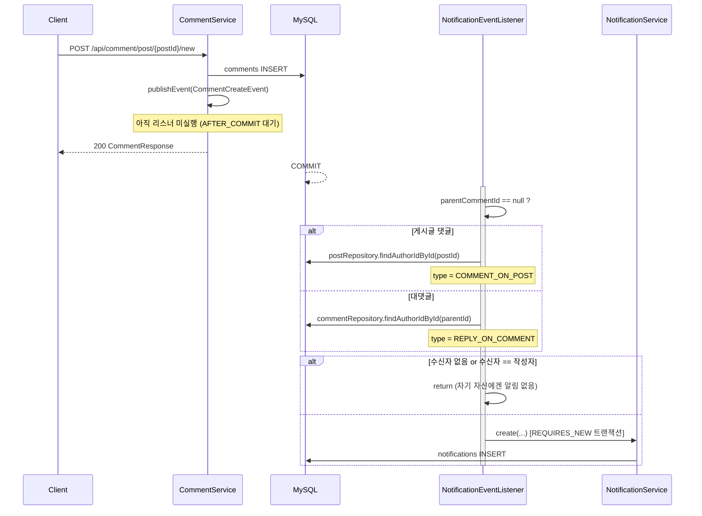

# 알림 이벤트 아키텍처

댓글 작성 시 **Spring ApplicationEvent**로 알림을 비동기 분리한다.
목적: 알림 생성 실패가 댓글 작성 트랜잭션을 롤백시키지 않게 하는 것.

## 흐름



## 이벤트 객체

`notification/CommentCreateEvent.java`

```java
public record CommentCreateEvent(
    Long commentId,
    Long postId,
    Long parentCommentId,   // null이면 게시글에 대한 댓글
    Long actorId            // 댓글 작성자
) {}
```

발행 위치: `comment/CommentService.java` — `create()` 안, `commentRepository.save()` 직후.

## 리스너

`notification/NotificationEventListener.java`

```java
@TransactionalEventListener(phase = TransactionPhase.AFTER_COMMIT)
@Transactional(propagation = Propagation.REQUIRES_NEW)
public void onCommentCreated(CommentCreateEvent event) { ... }
```

| 애노테이션 | 효과 |
|---|---|
| `AFTER_COMMIT` | 댓글 트랜잭션이 **커밋된 뒤에만** 실행. 롤백되면 알림 없음 |
| `REQUIRES_NEW` | 커밋 후에는 기존 트랜잭션이 닫혀 있으므로 **새 트랜잭션**이 필요 |

리스너는 `try/catch (RuntimeException)`으로 감싸 알림 저장 실패를 **로그만 남기고 삼킨다**.

> ⚠️ **동기 실행**이다. `@Async`가 없으므로 응답 스레드에서 커밋 직후 실행된다.
> 알림 저장이 느려지면 응답 지연으로 이어질 수 있다.

## 알림 종류

`notification/NotificationType.java`

| enum | 발생 조건 | 수신자 |
|---|---|---|
| `COMMENT_ON_POST` | 게시글에 최상위 댓글이 달림 | 게시글 작성자 |
| `REPLY_ON_COMMENT` | 댓글에 대댓글이 달림 | 부모 댓글 작성자 |

**자기 자신에게는 알림이 생성되지 않는다** (`recipientId.equals(event.actorId())` 체크).

## 메시지 생성

`Notification.toResponse()`에서 서버가 한국어 문장을 만들어 내려준다.

```java
type == REPLY_ON_COMMENT
    ? actor.getNickName() + "님이 댓글에 댓글을 달았습니다"
    : actor.getNickName() + "님이 게시글에 댓글을 달았습니다"
```

> 다국어가 필요해지면 프론트엔드에서 `type` + `actorUsername`으로 조립하도록 바꾸는 편이 낫다.
> 응답에 두 값이 모두 들어 있으므로 지금도 클라이언트 조립이 가능하다.

## 알림 소비

[[API-Notification]] 참조.

- `GET /api/notify/list` — 페이징 목록 (`@EntityGraph`로 actor 조인 로딩)
- `GET /api/notify/unreads` — 안 읽은 개수 (뱃지용)
- `PUT /api/notify/{id}/read` — 읽음 처리. 소유자가 아니면 `CANNOT_VIEW_NOTIFICATION`(403)

## 확장 포인트

현재 알림 트리거는 **댓글 생성 1가지뿐**이다. 아래는 미구현.

- 좋아요 알림 (`PostReaction` 생성 시) — [[API-Reaction]]
- 알림 전체 읽음 처리
- 알림 삭제
- 실시간 푸시 (SSE / WebSocket) — 현재는 클라이언트 폴링만 가능. [[프론트엔드-요구사항]] FR-8 참조

새 알림 종류 추가 시 절차:
1. `NotificationType`에 enum 추가
2. 이벤트 record 정의 + 도메인 서비스에서 `publishEvent`
3. 리스너에 `@TransactionalEventListener` 메서드 추가
4. `Notification.toResponse()`의 메시지 분기 추가
5. 이 문서와 [[API-Notification]] 갱신

## 관련 문서

- [[엔티티-Notification]]
- [[엔티티-Comment]]
- [[API-Notification]]
