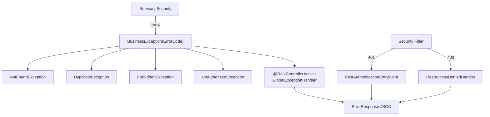

# 예외 처리 아키텍처

## 구조



핵심: **모든 에러는 `ErrorCode` enum 하나에서 상태코드와 메시지가 결정된다.**

## ErrorCode

`global/exception/ErrorCode.java`

```java
@Getter @RequiredArgsConstructor
public enum ErrorCode {
    USER_NOT_FOUND(HttpStatus.NOT_FOUND, "사용자를 찾을 수 없습니다."),
    ...
    private final HttpStatus status;
    private final String message;
}
```

전체 목록은 [[API-에러코드]] 참조.

## ErrorResponse

`global/exception/ErrorResponse.java` — **모든 실패 응답의 공통 바디**

```json
{
  "code": "POST_NOT_FOUND",
  "message": "게시글을 찾을 수 없습니다.",
  "timestamp": "2026-08-01T14:32:11.123"
}
```

| 필드 | 값 |
|---|---|
| `code` | `ErrorCode.name()` — 프론트엔드 분기용 **안정 식별자** |
| `message` | `ErrorCode.getMessage()` — 한국어, 사용자 노출 가능 |
| `timestamp` | `LocalDateTime.now()` |

> 프론트엔드는 **`message`가 아니라 `code`로 분기**해야 한다. 메시지는 변경될 수 있다.

## 예외 계층

`global/exception/`

| 클래스 | 부모 | 용도 |
|---|---|---|
| `BusinessException` | `RuntimeException` | 기본. `ErrorCode`를 담음 |
| `NotFoundException` | `BusinessException` | 404 |
| `DuplicateException` | `BusinessException` | 409 |
| `ForbiddenException` | `BusinessException` | 403 |
| `UnauthorizedException` | `BusinessException` | 401 |
| `OAuth2DuplicateEmailException` | (OAuth2 전용) | 소셜 가입 시 이메일 중복 |

> 하위 클래스는 **의미 구분용**일 뿐, 실제 HTTP 상태는 전달된 `ErrorCode.getStatus()`가 결정한다.
> 즉 `new NotFoundException(LOGIN_REQUIRED)`를 던지면 401이 나간다 (`UserProfileService`에 실제 그런 코드가 있음).

## GlobalExceptionHandler

`@RestControllerAdvice` — `global/exception/GlobalExceptionHandler.java`

| 잡는 예외 | 응답 상태 | ErrorCode |
|---|---|---|
| `BusinessException` | `errorCode.getStatus()` | 전달받은 그대로 |
| `MethodArgumentNotValidException` (`@Valid` 실패) | 400 | `INVALID_INPUT` |
| `MaxUploadSizeExceededException` | 400 | `MAX_UPLOAD_SIZE_EXCEEDED` |
| `HttpRequestMethodNotSupportedException` | **405** | `METHOD_NOT_ALLOWED` |
| `SQLIntegrityConstraintViolationException` | 400 | `SQL_INTEGRITY_ERROR` |
| `NullPointerException` | 500 | `INTERNAL_SERVER_ERROR` |

⚠️ **주의점**

1. `@Valid` 실패 시 **어떤 필드가 왜 실패했는지 응답에 담기지 않는다.** 항상 `"입력값이 올바르지 않습니다."` 만 내려간다 → 프론트엔드는 클라이언트 측 검증을 자체 구현해야 한다. [[프론트엔드-요구사항]] 참조.
2. `METHOD_NOT_ALLOWED` enum은 `HttpStatus.BAD_REQUEST(400)`로 정의돼 있는데, 핸들러는 `HttpStatus.METHOD_NOT_ALLOWED(405)`를 반환한다 → **body의 code와 실제 status가 불일치**. [[알려진-이슈]] 참조.
3. 🚨 잡히지 않는 예외는 **401 `LOGIN_REQUIRED`로 위장된다.** `/error`가 `permitAll`이 아니라서
   ERROR 디스패치가 보안 필터에 막히고 `RestAuthenticationEntryPoint`가 응답한다. (실측 확인)
   → [[알려진-이슈]] BE-25
4. Hibernate는 보통 `DataIntegrityViolationException`(Spring)을 던지므로, `SQLIntegrityConstraintViolationException` 핸들러는 거의 타지 않는다.

## 필터 레벨 예외 (Controller 도달 전)

`SecurityConfig.exceptionHandling()`

| 핸들러 | 트리거 | 응답 |
|---|---|---|
| `RestAuthenticationEntryPoint` | 미인증 접근 | **401** `LOGIN_REQUIRED` |
| `RestAccessDeniedHandler` | 인증됐지만 권한 부족 (`@PreAuthorize` 실패 포함) | **403** `ACCESS_DENIED` |

둘 다 `ObjectMapper`로 `ErrorResponse`를 직접 write 하므로 **바디 형식은 동일**하다.
Content-Type: `application/json;charset=UTF-8`

## 새 에러를 추가할 때

1. `ErrorCode`에 상수 추가 (상태코드 + 한국어 메시지)
2. 서비스에서 적절한 `BusinessException` 하위 타입으로 throw
3. [[API-에러코드]] 문서 표 갱신
4. 프론트엔드 `code` 분기 필요 시 [[API-클라이언트-가이드]] 갱신

## 관련 문서

- [[API-에러코드]]
- [[인증-인가-아키텍처]]
- [[알려진-이슈]]
