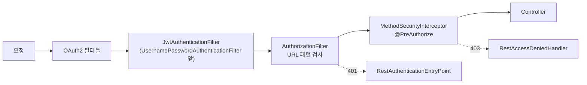
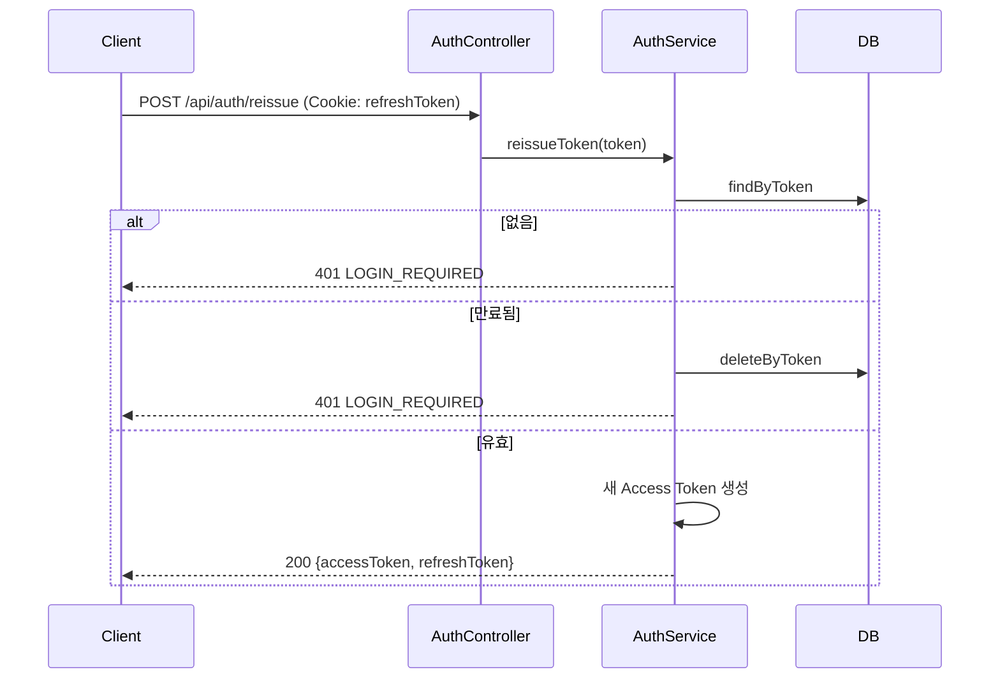

# 인증 · 인가 아키텍처

## 요약

- **인증(Authentication)**: JWT Access Token (HTTP 헤더) + Refresh Token (HttpOnly 쿠키)
- **인가(Authorization)**: URL 패턴 규칙 (`SecurityConfig`) + 메서드 보안 (`@PreAuthorize`)
- **소셜 로그인**: Spring Security 표준 OAuth2/OIDC (카카오·구글)
- **세션 미사용**: `SessionCreationPolicy.STATELESS`

## 1. 필터 체인

`global/config/SecurityConfig.java`



비활성화된 기능: `csrf`, `formLogin`, `httpBasic`.

## 2. JWT

### 발급 — `auth/jwt/JwtTokenProvider.java`

```java
Jwts.builder()
    .subject(userEmail)      // ⚠️ subject는 userId가 아니라 email
    .issuedAt(now)
    .expiration(now + 3600s)
    .signWith(HS256 key)
    .compact();
```

| 항목 | 값 |
|---|---|
| 알고리즘 | HS256 (`Keys.hmacShaKeyFor`, Base64 디코딩된 시크릿) |
| `subject` | 사용자 **email** |
| 유효기간 | `jwt.access-token-validity-seconds` = 3600초 |
| 커스텀 클레임 | **없음** (role, nickname 등 미포함) |

> 토큰에 role이 없으므로 **매 요청마다 DB에서 사용자를 다시 조회**한다 (`CustomUserDetailService.loadUserByUsername`).

### 검증 — `auth/jwt/JwtAuthenticationFilter.java`

```
Authorization: Bearer {token}
      ↓ resolveToken()  ("Bearer " prefix 제거)
      ↓ validateToken() (실패 시 예외 삼키고 false)
      ↓ getUserEmail()  → subject
      ↓ CustomUserDetailService.loadUserByUsername(email)  → DB 조회
      ↓ SecurityContextHolder에 UsernamePasswordAuthenticationToken 저장
```

토큰이 없거나 유효하지 않으면 **예외를 던지지 않고 그대로 통과**시킨다.
이후 `AuthorizationFilter`가 익명 사용자로 판단해 401을 낸다.
→ 덕분에 `permitAll` 엔드포인트에서 "로그인했으면 개인화, 아니면 익명"이 가능하다 (예: `GET /api/post/{id}`).

### CustomUserDetails

`auth/CustomUserDetails.java` — `User` 엔티티를 감싼다.

| 메서드 | 반환 |
|---|---|
| `getUsername()` | `user.getEmail()` |
| `getId()` | `user.getId()` ← **컨트롤러에서 주로 쓰는 값** |
| `getNickName()` | `user.getNickName()` |
| `getAuthorities()` | `ROLE_USER` 또는 `ROLE_ADMIN` |

컨트롤러에서는 `@AuthenticationPrincipal CustomUserDetails userDetails`로 주입받는다.

## 3. Refresh Token

`global/entity/RefreshToken.java`, `auth/AuthService.java`, `auth/RefreshCookieFactory.java`

- 값: **UUID** (JWT 아님)
- 저장: DB `refresh_token` 테이블 — `user_id` **UNIQUE** → **사용자당 1개**
- 재발급 시 기존 레코드를 `update()`로 덮어씀 → 다른 기기 세션은 무효화됨
- 유효기간: `jwt.refresh-token-validity-seconds` = 36000초 (10시간)

### 쿠키 속성 (`app.refresh-cookie`)

| 속성 | 값 | 비고 |
|---|---|---|
| `name` | `refreshToken` | |
| `httpOnly` | `true` | JS 접근 차단 |
| `secure` | `false` | 로컬 개발용. **운영에서는 true 필수** |
| `sameSite` | `Strict` | ⚠️ 다른 오리진 프론트엔드에서 전송 안 됨 → [[알려진-이슈]] |
| `path` | `/api/auth` | 이 경로 요청에만 자동 전송 |

### 재발급 흐름



> Refresh Token 자체는 **회전(rotate)되지 않고** 기존 값을 그대로 돌려준다.

## 4. 인가 — URL 패턴

`SecurityConfig.securityFilterChain()`

| 패턴 | 정책 |
|---|---|
| `/api/auth/**` | `permitAll` |
| `/api/oauth/**` | `permitAll` |
| `GET /api/board/**` | `permitAll` |
| `GET /api/post/**` | `permitAll` |
| `GET /api/comment/**` | `permitAll` |
| `GET /images/**` | `permitAll` |
| `GET /api/user/me` | `authenticated` |
| **그 외 전부** | `authenticated` |

> `/oauth2/authorization/**`, `/login/oauth2/code/**`는 명시적 `permitAll`이 없지만,
> OAuth2 필터가 `AuthorizationFilter`보다 **앞에서** 요청을 가로채므로 동작한다.

전체 매트릭스는 [[API-개요]] 참조.

## 5. 인가 — 메서드 보안

`@EnableMethodSecurity`로 활성화. 두 가지 패턴이 쓰인다.

### (a) 역할 기반

```java
@PreAuthorize("hasRole('ADMIN')")   // BoardController: 생성/수정/삭제
```

### (b) 소유권 기반 — SpEL에서 Bean 호출

```java
@PreAuthorize("@postSecurity.isAuthor(#id, authentication.principal)")     // PostController
@PreAuthorize("@commentSecurity.isAuthor(#id, authentication.principal)")  // CommentController
```

`post/PostSecurity.java`, `comment/CommentSecurity.java`

```java
@Component("postSecurity")
public boolean isAuthor(Long postId, CustomUserDetails user) {
    Long authorId = postRepository.findAuthorIdById(postId)   // 작성자 ID만 조회 (경량)
        .orElseThrow(() -> new NotFoundException(POST_NOT_FOUND));
    return authorId.equals(user.getId());
}
```

**장점**: 엔티티 전체를 로딩하지 않고 작성자 ID만 조회. 컨트롤러 진입 전에 403 처리.
**주의**: 존재하지 않는 리소스는 403이 아니라 **404**가 나간다 (`NotFoundException` 우선).

## 6. 소셜 로그인

두 가지 구현이 **공존**한다.

| 방식 | 경로 | 상태 |
|---|---|---|
| 수동 구현 (`auth/oauth`) | `/api/oauth/kakao/login`, `/callback` | 레거시. 학습용으로 남아 있음 |
| Spring Security 표준 (`auth/oauth2`) | `/oauth2/authorization/{kakao\|google}` | **현행 권장** |

자세한 흐름은 [[API-OAuth]] 참조.

### 표준 방식 핵심 컴포넌트

| 클래스 | 역할 |
|---|---|
| `CustomOAuth2AuthorizationRequestRepository` | `state` 등 인증요청을 **세션 대신 쿠키**(`oauthRequest`, Base64 JSON, TTL 5분)에 저장 — STATELESS 유지 |
| `CustomOAuth2UserService` | OAuth2(카카오) 사용자 정보 → `findOrCreate()`로 User + UserProfile 생성 |
| `CustomOidcUserService` | OIDC(구글). `OidcUserService`에 위임 후 동일한 `findOrCreate()` 호출 |
| `OAuth2LoginSuccessHandler` | JWT 발급 → `UserResponse` JSON 직접 write + Refresh 쿠키 설정 |
| `OAuth2LoginFailureHandler` | 실패 시 `ErrorResponse` JSON. 이메일 중복이면 `DUPLICATE_USER_EMAIL` |

### 소셜 계정 식별 규칙

```
providerId = "{PROVIDER}_{고유ID}"     예: "KAKAO_123456", "GOOGLE_10769150350006150715"
```

- 카카오 고유ID: 속성 `id`
- 구글 고유ID: 속성 `sub` (OIDC 표준)
- 비밀번호에는 랜덤 UUID를 BCrypt 인코딩해 저장 (폼 로그인 불가)
- 동일 email이 이미 존재하면 `OAuth2DuplicateEmailException` → 409

## 7. 비밀번호

`BCryptPasswordEncoder` (`SecurityConfig.passwordEncoder()`).
로그인은 `AuthenticationManager.authenticate()`에 위임한다 (수동 `matches()` 비교 코드는 주석 처리됨).

## 관련 문서

- [[API-Auth]] · [[API-OAuth]]
- [[토큰-저장-전략]] — 프론트엔드 관점
- [[예외-처리-아키텍처]]
- [[알려진-이슈]]
