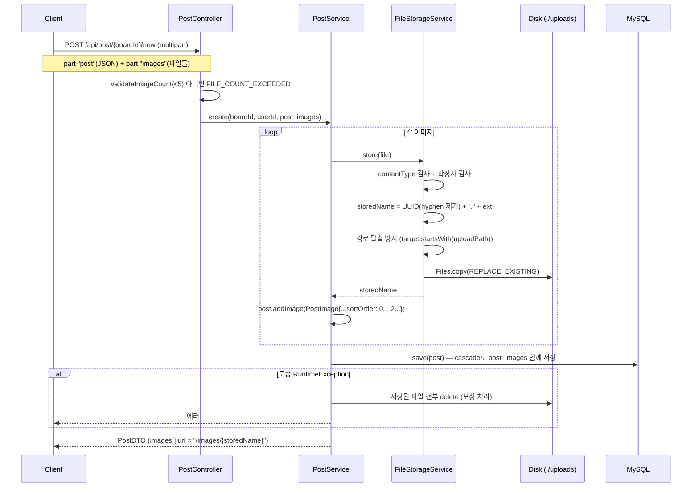

# 파일 업로드 아키텍처

게시글 작성 시 이미지를 함께 올린다. 저장소는 **로컬 디스크**, 서빙은 **Spring 정적 리소스 핸들러**.

## 전체 흐름



## FileStorageService

`post/FileStorageService.java`

### 저장 경로

```java
uploadPath = Paths.get("${app.upload.dir}").toAbsolutePath().normalize();
```

- 설정: `app.upload.dir` = `${APP_UPLOAD_DIR:./uploads}` — 환경변수 없으면 프로젝트 루트의 `./uploads`
- `@PostConstruct init()`에서 디렉터리를 생성. 실패 시 `INVALID_FILE_UPLOAD_DIR`(500)

### 검증 규칙

| 검사 | 허용 값 | 실패 시 |
|---|---|---|
| 파일 존재 | null/empty 아님 | `INVALID_FILE_TYPE` (400) |
| Content-Type | `image/png`, `image/jpeg`, `image/gif`, `image/webp` | `INVALID_FILE_TYPE` |
| 확장자 | `png`, `jpg`, `jpeg`, `gif`, `webp` | `INVALID_FILE_TYPE` |
| 경로 탈출 | `target.startsWith(uploadPath)` | `INVALID_FILE_TYPE` |
| 개수 | ≤ 5 (`PostController.MAX_IMAGES`) | `FILE_COUNT_EXCEEDED` (400) |
| 파일당 크기 | ≤ 2MB (`spring.servlet.multipart.max-file-size`) | `MAX_UPLOAD_SIZE_EXCEEDED` (400) |
| 요청 전체 크기 | ≤ 20MB | `MAX_UPLOAD_SIZE_EXCEEDED` |
| 복사 I/O 실패 | — | `FILE_UPLOAD_FAILED` (500) |

Content-Type과 확장자를 **둘 다** 검사한다. 단, 파일 시그니처(매직 넘버)는 검사하지 않는다.

### 저장 파일명

```
UUID.randomUUID().toString().replace("-", "") + "." + ext
→ 예: 3f2a9c1b4d5e6f708192a3b4c5d6e7f8.png
```

원본 파일명은 DB `post_images.original_name`에만 보관 → 경로 조작·중복·한글 파일명 문제 회피.

### 삭제

`delete(fileName)`은 `Files.deleteIfExists`. 실패해도 로그만 남기고 예외를 던지지 않는다.
게시글 생성 중 실패 시 **보상 트랜잭션**으로 호출된다 (`PostService.create`의 `catch (RuntimeException)` 블록).

## 정적 서빙

`global/config/WebConfig.java`

```java
registry.addResourceHandler("/images/**")
        .addResourceLocations(uploadPath.toUri().toString());
```

- URL: `GET /images/{storedName}`
- 보안: `SecurityConfig`에서 `GET /images/**` → `permitAll` (인증 불필요)
- `PostImage.toDto()`가 `URL_PREFIX = "/images/"` 를 붙여 응답에 담는다

프론트엔드에서는 그대로 `` 로 사용하면 된다.

## 알려진 한계

| 항목 | 현재 상태 |
|---|---|
| 게시글 **수정** 시 이미지 교체 | ❌ 미구현. `PostService.update()`는 title/body만 수정 |
| 게시글 **삭제** 시 디스크 파일 정리 | ❌ 미구현. DB 레코드만 cascade 삭제, 파일은 고아로 남음 |
| 썸네일 생성 / 리사이즈 | ❌ 없음. `PostListResponse.thumbnailUrl` 필드는 정의만 되고 미사용 |
| 파일 시그니처 검증 | ❌ 없음 (확장자·MIME 위조 가능) |
| 외부 스토리지(S3 등) | ❌ 로컬 디스크 전용 → 다중 인스턴스 배포 불가 |
| `uploads/` 디렉터리 | `.gitignore`에 없음 → 업로드 파일이 커밋될 수 있음 |

→ [[알려진-이슈]] 참조

## 관련 문서

- [[API-Post]] — multipart 요청 예시
- [[엔티티-PostImage]]
- [[환경변수]]
