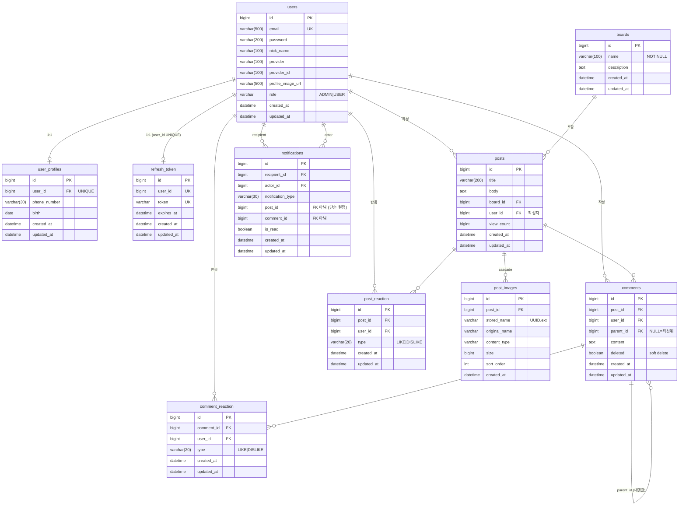

# 도메인 모델 · ERD

DB: MySQL `board` / `ddl-auto: update` (엔티티가 스키마의 단일 진실 공급원)

## ERD

## 테이블 ↔ 클래스 매핑

| 테이블 | 엔티티 클래스 | 문서 |
|---|---|---|
| `users` | `global.entity.User` | [[엔티티-User]] |
| `user_profiles` | `global.entity.UserProfile` | [[엔티티-UserProfile]] |
| `refresh_token` | `global.entity.RefreshToken` | [[엔티티-RefreshToken]] |
| `boards` | `global.entity.Board` | [[엔티티-Board]] |
| `posts` | `global.entity.Post` | [[엔티티-Post]] |
| `post_images` | `global.entity.PostImage` | [[엔티티-PostImage]] |
| `comments` | `global.entity.Comment` | [[엔티티-Comment]] |
| `post_reaction` | `reaction.PostReaction` | [[엔티티-Reaction]] |
| `comment_reaction` | `reaction.CommentReaction` | [[엔티티-Reaction]] |
| `notifications` | `notification.Notification` | [[엔티티-Notification]] |

## 공통 관례

| 관례 | 내용 |
|---|---|
| PK | `Long id`, `GenerationType.IDENTITY` (MySQL AUTO_INCREMENT) |
| 연관관계 | 전부 `FetchType.LAZY` — N+1은 `@EntityGraph` / `join fetch` / `@BatchSize`로 대응 |
| 타임스탬프 | `created_at`, `updated_at` 컬럼. 대부분 `@Builder.Default = LocalDateTime.now()`로 **직접 초기화** |
| DTO 변환 | 엔티티에 `toDTO()` / `toResponse()` 정적 메서드 |
| 롬복 | `@Getter @Setter @NoArgsConstructor @AllArgsConstructor @Builder` 조합이 표준 |

## 유니크 제약

| 테이블 | 제약 |
|---|---|
| `users` | `email` UNIQUE |
| `user_profiles` | `user_id` UNIQUE (1:1) |
| `refresh_token` | `user_id` UNIQUE, `token` UNIQUE → **사용자당 세션 1개** |
| `post_reaction` | `uk_post_reaction (post_id, user_id)` → 사용자당 게시글 1반응 |
| `comment_reaction` | `uk_comment_reaction (comment_id, user_id)` |

`boards.name`은 **DB 유니크 제약이 없다**. 중복 검사는 애플리케이션 레벨(`boardRepository.existsByName`)에서만 한다 → 동시 요청 시 중복 가능.

## Auditing 주의사항

`@EnableJpaAuditing`은 켜져 있으나, `@LastModifiedDate`가 동작하려면 엔티티에 `@EntityListeners(AuditingEntityListener.class)`가 있어야 한다.

| 엔티티 | `@EntityListeners` | 결과 |
|---|---|---|
| `User`, `UserProfile`, `Board`, `Post`, `RefreshToken` | ✅ 있음 | `updated_at` 자동 갱신 |
| `Comment`, `PostImage`, `PostReaction`, `CommentReaction`, `Notification` | ❌ 없음 | `updated_at`이 **생성 시각에 고정** |

→ [[알려진-이슈]] 참조. `updated_at`을 "수정 시각"으로 신뢰하면 안 된다.

## 삭제 정책

| 대상 | 정책 |
|---|---|
| `Post` | **Hard delete**. `post_images`는 `cascade = ALL, orphanRemoval` 로 함께 삭제. 단 디스크 파일은 남음 |
| `Comment` | **Soft delete** (`deleted = true`). 내용은 `"삭제된 게시글입니다"`로 치환 응답 |
| `Board` | Hard delete. 게시글이 있으면 FK 위반 → `SQL_INTEGRITY_ERROR` |
| `RefreshToken` | 로그아웃/만료 시 Hard delete |
| `Reaction` | 같은 타입 재요청 시 Hard delete (토글) |

## 관련 문서

- [[패키지-구조]]
- [[API-개요]]
- [[프론트엔드-데이터-모델]]
