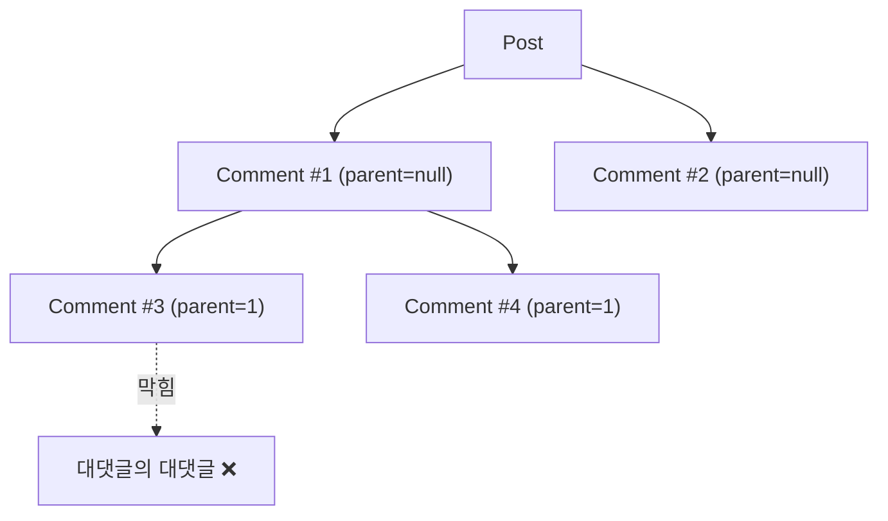

# 엔티티: Comment

`global/entity/Comment.java` → 테이블 `comments`

**2단계(최상위 댓글 + 대댓글)** 로 제한된 자기참조 트리.

## 필드

| 필드 | 컬럼 | 타입 | 제약 |
|---|---|---|---|
| `id` | `id` | Long | PK |
| `post` | `post_id` | `@ManyToOne(LAZY)` | NOT NULL |
| `user` | `user_id` | `@ManyToOne(LAZY)` | NOT NULL |
| `parent` | `parent_id` | `@ManyToOne(LAZY)` | nullable — **null이면 최상위** |
| `children` | — | `@OneToMany(mappedBy="parent")` | `@OrderBy("createdAt asc")`, `@BatchSize(100)` |
| `content` | `content` | TEXT | NOT NULL (`@Size(max=1000)` on 요청 DTO) |
| `deleted` | `deleted` | boolean | NOT NULL — soft delete 플래그 |
| `createdAt` | `created_at` | LocalDateTime | 기본 `now()` |
| `updatedAt` | `updated_at` | LocalDateTime | `@LastModifiedDate` — ⚠️ `@EntityListeners` **없음** → 갱신 안 됨 |

## 계층 구조



**깊이 2단계 제한**은 `CommentService.create()`에서 강제된다.

## 도메인 메서드

```java
boolean isRoot()                  // parent == null
boolean isReply()                 // parent != null
boolean isAuthor(Long userId)
void addReply(Comment reply)      // children 추가 + reply.parent 설정 (양방향 편의)
void update(String content)
void softDelete()                 // deleted = true
```

## 생성 시 검증 규칙

`comment/CommentService.java` — `parentId`가 있을 때만 적용

| 순서 | 검사 | 실패 시 ErrorCode |
|---|---|---|
| 1 | 부모 댓글 존재 | `COMMENT_NOT_FOUND` (404) |
| 2 | 부모가 같은 게시글의 댓글인가 | `COMMENT_POST_MISMATCH` (400) |
| 3 | 부모가 삭제되지 않았는가 | `CANNOT_REPLY_TO_DELETED` (400) |
| 4 | 부모가 대댓글이 아닌가 | `CANNOT_REPLY_TO_REPLY` (400) |

통과하면 `parent.addReply(comment)` 호출.

## Soft Delete

```java
void softDelete() { this.deleted = true; }
```

레코드는 남고 플래그만 세운다. 이유: 대댓글이 달린 댓글을 지워도 트리가 끊어지지 않게 하기 위함.

응답 시 내용이 치환된다.

```java
comment.isDeleted() ? CommentResponse.DELETED_CONTENT : comment.getContent()
// DELETED_CONTENT = "삭제된 게시글입니다"
```

> 상수 이름과 문구가 "게시글"로 되어 있으나 실제로는 **댓글** 삭제 표시다.
> 작성자 닉네임(`authorUsername`)은 삭제 후에도 **그대로 노출**된다.

## 응답 변환

```java
Comment.toResponse(comment) → CommentResponse (record)
```

```java
public record CommentResponse(
    Long id,
    String authorUsername,        // user.getNickName()
    String content,               // 삭제 시 "삭제된 게시글입니다"
    boolean deleted,
    LocalDateTime createdAt,
    long likeCount,
    long dislikeCount,
    ReactionType myReaction,      // 비로그인이거나 반응 없으면 null
    List<CommentResponse> children
) {}
```

`children`은 **최상위 댓글일 때만** 채워진다 (`isRoot()` 검사). 대댓글의 children은 항상 `[]`.

> 응답에 `parentId`가 없다. 중첩 구조로만 표현된다.
> 작성자 **ID도 없다** → 프론트엔드에서 "내 댓글인지" 판별하려면 닉네임 비교밖에 방법이 없다. [[알려진-이슈]] BE-10

### 오버로드 2개

`Post.toDTO`와 같은 패턴이다.

```java
Comment.toResponse(comment)                      // 반응 0/null (새로 만든 댓글)
Comment.toResponse(comment, reactionSummaries)   // 배치로 모아온 반응 집계를 적용
```

두 번째 인자는 `Map<Long, ReactionResponse>`이며, 대댓글까지 재귀적으로 같은 맵을 사용한다.
목록 조회에서 `CommentService`가 최상위 + 대댓글 id를 모두 모아 한 번에 조회한 결과다. → [[API-Reaction]]

## 조회

`comment/CommentRepository.java`

```java
@EntityGraph(attributePaths = {"user"})
Page<Comment> findByPostIdAndParentIsNull(Long postId, Pageable pageable);

@Query("SELECT c.user.id FROM Comment c WHERE c.id = :id")
Optional<Long> findAuthorIdById(Long commentId);
```

- 페이징 단위는 **최상위 댓글**. 대댓글은 각 댓글에 중첩되어 함께 내려간다 (`@BatchSize(100)`로 로딩)
- 대댓글 개수는 페이징 계산에 포함되지 않는다

## 권한

| 작업 | 권한 |
|---|---|
| 목록 조회 | 누구나 (`GET /api/comment/**` permitAll) |
| 작성 | 인증된 사용자 |
| 수정 / 삭제 | 작성자 본인 — `@PreAuthorize("@commentSecurity.isAuthor(#id, authentication.principal)")` |

## 알림 연동

댓글 생성 시 `CommentCreateEvent`가 발행된다 → [[알림-이벤트-아키텍처]]

| parentId | 알림 종류 | 수신자 |
|---|---|---|
| null | `COMMENT_ON_POST` | 게시글 작성자 |
| 있음 | `REPLY_ON_COMMENT` | 부모 댓글 작성자 |

## 수정 규칙

`CommentService.update()`

```java
// 삭제된(soft delete) 댓글은 수정할 수 없다
if (comment.isDeleted()) {
    throw new BusinessException(ErrorCode.CANNOT_EDIT_DELETED);
}

comment.update(request.getContent());
```

수정해도 기존 반응은 유지되며 응답에 함께 담긴다.

> 2026-08-01 이전에는 이 조건이 반전되어 정상 댓글 수정이 항상 실패했다(BE-03). 수정 완료.

## 관련 문서

- [[API-Comment]]
- [[엔티티-Post]] · [[엔티티-Notification]] · [[엔티티-Reaction]]
