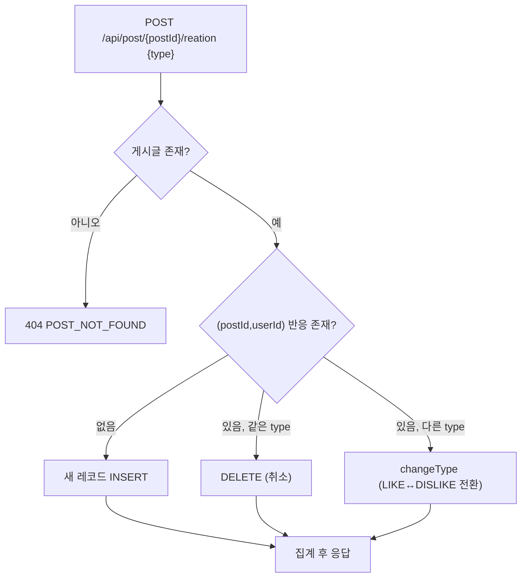

# 엔티티: PostReaction / CommentReaction

`reaction/PostReaction.java`, `reaction/CommentReaction.java`
→ 테이블 `post_reaction`, `comment_reaction`

좋아요 / 싫어요. 두 엔티티는 대상(post vs comment)만 다르고 구조가 동일하다.

> 다른 엔티티와 달리 `global/entity`가 아니라 `reaction` 패키지에 있다.

## ReactionType

```java
public enum ReactionType { LIKE, DISLIKE }
```

## 필드 (공통)

| 필드 | 컬럼 | 타입 | 제약 |
|---|---|---|---|
| `id` | `id` | Long | PK |
| `post` / `comment` | `post_id` / `comment_id` | `@ManyToOne(LAZY)` | NOT NULL |
| `user` | `user_id` | `@ManyToOne(LAZY)` | NOT NULL |
| `type` | `type` | enum(STRING, 20) | NOT NULL |
| `createdAt` | `created_at` | LocalDateTime | 기본 `now()` |
| `updatedAt` | `updated_at` | LocalDateTime | `@LastModifiedDate` — ⚠️ `@EntityListeners` 없음 |

## 유니크 제약

```java
@Table(name = "post_reaction",
       uniqueConstraints = @UniqueConstraint(
           name = "uk_post_reaction", columnNames = {"post_id", "user_id"}))
```

**사용자당 대상당 반응 1개.** LIKE와 DISLIKE를 동시에 가질 수 없다.

## 도메인 메서드

```java
void changeType(ReactionType type)
```

## 토글 로직

게시글·댓글이 동일한 규칙을 쓴다.

| 대상 | 서비스 메서드 | 집계 메서드 |
|---|---|---|
| 게시글 | `ReactionService.react(postId, userId, type)` | `buildPostReactionResponse()` |
| 댓글 | `ReactionService.reactToComment(commentId, userId, type)` | `buildCommentReactionResponse()` |

아래는 게시글 기준이며, 댓글도 대상만 다르고 흐름은 같다.



| 현재 상태 | 요청 | 결과 |
|---|---|---|
| 반응 없음 | LIKE | LIKE 생성 |
| LIKE | LIKE | **삭제** (취소) |
| LIKE | DISLIKE | DISLIKE로 전환 |
| DISLIKE | LIKE | LIKE로 전환 |

`getReferenceById()`로 프록시만 얻어 INSERT하므로 User/Post를 실제 SELECT하지 않는다.

## 응답

```java
ReactionResponse { long likeCount; long dislikeCount; ReactionType myReaction; }
```

`myReaction`은 취소한 직후에는 **null**이다.

집계 쿼리:

```java
countByPostIdAndType(postId, LIKE)
countByPostIdAndType(postId, DISLIKE)
findByPostIdAndUserId(postId, userId).map(PostReaction::getType).orElse(null)
```

→ 반응 1번에 카운트 쿼리 2회 + 조회 1회가 실행된다.

## 리포지토리

```java
// PostReactionRepository
Optional<PostReaction> findByPostIdAndUserId(Long postId, Long userId);
long countByPostIdAndType(Long postId, ReactionType type);

// CommentReactionRepository
Optional<CommentReaction> findByCommentIdAndUserId(Long commentId, Long userId);
long countByCommentIdAndType(Long commentId, ReactionType type);
```

## ⚠️ 구현 상태

| 항목 | 상태 |
|---|---|
| 게시글 반응 API | ⚠️ 동작하지만 **경로에 오타** — `/reation` (`reaction` 아님) |
| 댓글 반응 API | ✅ `POST /api/comment/{commentId}/reaction` |
| 게시글 조회 시 반응 표시 | ✅ `PostDTO.like/disLike/myReaction` (상세 + 목록) |
| 댓글 조회 시 반응 표시 | ✅ `CommentResponse.likeCount/dislikeCount/myReaction` |
| N+1 방지 배치 집계 | ✅ 대상 수와 무관하게 쿼리 2회 |
| 삭제된 댓글 반응 차단 | ❌ 존재 여부만 검사하고 `deleted`는 보지 않음 |
| 반응 알림 | ❌ 미구현 |

## 배치 집계용 조회 DTO

`reaction/dto/` — 목록 조회에서 N+1을 피하기 위한 JPQL 생성자 표현식 전용 record.
게시글·댓글 양쪽에서 공유한다(`targetId`가 `post_id` 또는 `comment_id`).

```java
record ReactionCount(Long targetId, ReactionType type, long count)
record UserReaction(Long targetId, ReactionType type)
```

`ReactionService.summarizePostReactions()` / `summarizeCommentReactions()`가 이를 받아
`Map<Long, ReactionResponse>`로 합친다. → [[API-Reaction]]

→ [[알려진-이슈]], [[API-Reaction]]

## 관련 문서

- [[엔티티-Post]] · [[엔티티-Comment]]
- [[API-Reaction]]
