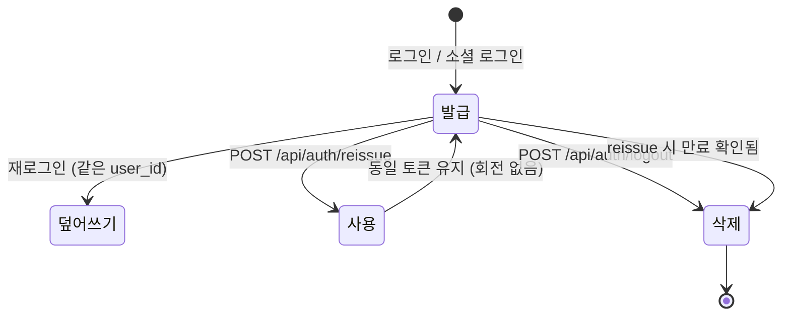

# 엔티티: RefreshToken

`global/entity/RefreshToken.java` → 테이블 `refresh_token`

Access Token 재발급을 위한 서버측 저장 토큰.

## 필드

| 필드 | 컬럼 | 타입 | 제약 |
|---|---|---|---|
| `id` | `id` | Long | PK |
| `userId` | `user_id` | Long | **NOT NULL, UNIQUE** — FK 아님, 단순 컬럼 |
| `token` | `token` | String | **NOT NULL, UNIQUE** — UUID 문자열 |
| `expiresAt` | `expires_at` | LocalDateTime | NOT NULL |
| `createdAt` | `created_at` | LocalDateTime | `@CreatedDate`, NOT NULL |
| `updatedAt` | `updated_at` | LocalDateTime | `@LastModifiedDate`, NOT NULL |

`@EntityListeners(AuditingEntityListener.class)` ✅ — 이 엔티티만 `@CreatedDate`를 쓴다.

## 도메인 메서드

```java
boolean isExpired()                              // expiresAt.isBefore(now)
void update(String token, LocalDateTime exp)     // 재발급 시 덮어쓰기
```

## 핵심 제약: 사용자당 토큰 1개

`user_id`가 UNIQUE이므로 **한 사용자는 Refresh Token을 하나만 가진다.**

`AuthService.issueRefreshToken(userId)`

```java
refreshTokenRepository.findByUserId(userId)
    .ifPresentOrElse(
        exist -> exist.update(token, expiresAt),   // 기존 것 덮어씀
        ()    -> refreshTokenRepository.save(new RefreshToken(...)));
```

**결과**: 다른 기기에서 로그인하면 기존 기기의 Refresh Token이 무효화된다 (= 강제 단일 세션).
멀티 디바이스를 지원하려면 UNIQUE 제약을 풀고 `(userId, deviceId)` 조합으로 바꿔야 한다.

## 값의 성격

- JWT가 **아니다**. 순수 `UUID.randomUUID().toString()`
- 서명·클레임이 없으므로 반드시 DB 조회로 검증한다
- 유효기간: `jwt.refresh-token-validity-seconds` = **36000초 (10시간)**

## 생명주기



| 동작 | 코드 |
|---|---|
| 발급 | `AuthService.issueRefreshToken()` / `issueRefreshTokenPair()` |
| 검증·재발급 | `AuthService.reissueToken()` |
| 삭제 | `AuthService.logout()` → `findByToken().ifPresent(delete)` |

> `reissueToken()`은 **새 Refresh Token을 만들지 않고 기존 값을 그대로 반환**한다.
> 즉 토큰 회전(rotation)이 없다 → 탈취된 토큰은 만료까지 계속 유효하다.

## 리포지토리

`auth/RefreshTokenRepository.java`

```java
Optional<RefreshToken> findByToken(String token);
Optional<RefreshToken> findByUserId(Long userId);
void deleteByToken(String token);
```

## 클라이언트 전달 방식

`RefreshCookieFactory`가 만드는 **HttpOnly 쿠키**로 전달된다.

```
Set-Cookie: refreshToken={uuid}; HttpOnly; Path=/api/auth; SameSite=Strict; Max-Age=36000
```

동시에 `UserResponse.refreshToken` 필드로 **바디에도 노출**된다 (디버그용, 운영 제거 대상).

## 만료된 토큰 정리

만료된 레코드는 `reissue` 요청이 들어와서 만료가 확인될 때만 삭제된다.
**배치 정리 작업(스케줄러)이 없다** → 로그인 후 방치된 사용자의 만료 토큰이 테이블에 계속 쌓인다.

## 관련 문서

- [[인증-인가-아키텍처]]
- [[API-Auth]]
- [[토큰-저장-전략]]
- [[알려진-이슈]]
