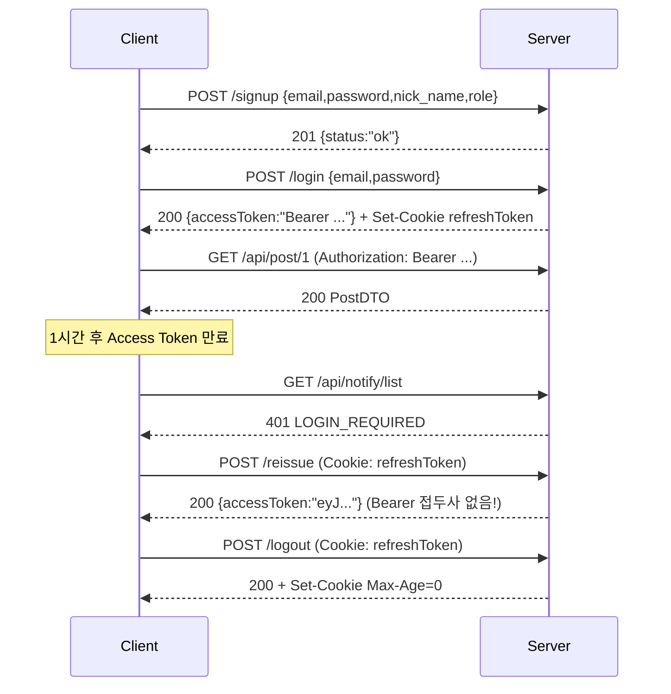

# API: 인증 (`/api/auth`)

`auth/AuthController.java` · 전부 `permitAll`

---

## POST `/api/auth/signup` — 회원가입

### 요청

```json
{
  "email": "user@example.com",
  "password": "password123",
  "nick_name": "홍길동",
  "role": "USER"
}
```

| 필드 | 타입 | 검증 | 비고 |
|---|---|---|---|
| `email` | string | `@NotBlank` | 형식 검증(`@Email`)은 **없음** |
| `password` | string | `@NotBlank @Size(min=8, max=30)` | |
| `nick_name` | string | `@NotBlank` | ⚠️ **스네이크 케이스** (`@JsonProperty("nick_name")`) |
| `role` | string | `@NotBlank` | `"ADMIN"`이면 ADMIN, 그 외 전부 USER |

> 🚨 `role`을 클라이언트가 지정한다. `"ADMIN"`을 보내면 관리자로 가입된다. [[알려진-이슈]]
> 프론트엔드에서는 항상 `"USER"` 고정 전송.

### 응답 `201 Created`

```json
{ "status": "ok", "message": null }
```

### 에러

| 상태 | code | 조건 |
|---|---|---|
| 400 | `INVALID_INPUT` | 검증 실패 |
| 409 | `DUPLICATE_USER_EMAIL` | 이메일 중복 |

### 부가 동작

`UserProfile` 레코드가 함께 생성된다 (빈 값). → [[엔티티-UserProfile]]

---

## POST `/api/auth/login` — 로그인

### 요청

```json
{ "email": "user@example.com", "password": "password123" }
```

| 필드 | 검증 |
|---|---|
| `email` | `@NotBlank` |
| `password` | `@NotBlank @Size(min=8)` |

### 응답 `200 OK`

```json
{
  "id": 1,
  "email": "user@example.com",
  "nickName": "홍길동",
  "accessToken": "Bearer eyJhbGciOiJIUzI1NiJ9...",
  "refreshToken": "3f2a9c1b-4d5e-6f70-8192-a3b4c5d6e7f8",
  "role": null
}
```

```http
Set-Cookie: refreshToken=3f2a...; Max-Age=36000; Path=/api/auth; HttpOnly; SameSite=Strict
```

⚠️ **주의**

- `accessToken`에 **`"Bearer "` 접두사가 이미 포함**되어 있다 → 헤더에 그대로 넣으면 된다
- `refreshToken`이 바디에도 노출된다 (디버그용, 운영 제거 예정) — 프론트엔드는 **쿠키만 신뢰**할 것
- `role`은 **항상 null**이다 (설정 코드가 주석 처리됨). 관리자 여부는 클라이언트에서 알 수 없다 → [[알려진-이슈]]

### 에러

| 상태 | code | 조건 |
|---|---|---|
| 400 | `INVALID_INPUT` | 검증 실패 |
| 401 | `LOGIN_REQUIRED` | 이메일/비밀번호 불일치 (`AuthenticationException`을 모두 이걸로 변환) |

> 실패 시 `LOGIN_FAILED`가 아니라 `LOGIN_REQUIRED`가 온다.

---

## POST `/api/auth/logout` — 로그아웃

### 요청

바디 없음. `Cookie: refreshToken={uuid}` (선택)

### 응답 `200 OK`

바디 없음.

```http
Set-Cookie: refreshToken=; Max-Age=0; Path=/api/auth; HttpOnly; SameSite=Strict
```

쿠키가 없어도 **200을 반환**한다 (멱등).
서버측에서는 `refresh_token` 레코드를 삭제한다. Access Token은 만료 전까지 계속 유효하다(블랙리스트 없음).

---

## POST `/api/auth/reissue` — Access Token 재발급

### 요청

바디 없음. `Cookie: refreshToken={uuid}` **필수**

### 응답 `200 OK`

```json
{
  "accessToken": "eyJhbGciOiJIUzI1NiJ9...",
  "refreshToken": "3f2a9c1b-4d5e-6f70-8192-a3b4c5d6e7f8"
}
```

⚠️ **여기서는 `accessToken`에 `"Bearer "` 접두사가 없다.** 로그인 응답과 형식이 다르다.
클라이언트에서 정규화 필요 → [[API-클라이언트-가이드]]

`refreshToken`은 기존 값 그대로 (회전 없음). 새 `Set-Cookie`도 내려가지 않는다.

### 에러

| 상태 | code | 조건 |
|---|---|---|
| 401 | `LOGIN_REQUIRED` | 쿠키 없음 / DB에 토큰 없음 / 만료됨 / 사용자 없음 |

만료가 확인되면 해당 레코드는 DB에서 삭제된다.

---

## 전체 흐름



## 관련 문서

- [[인증-인가-아키텍처]]
- [[토큰-저장-전략]]
- [[API-OAuth]]
- [[엔티티-RefreshToken]]
