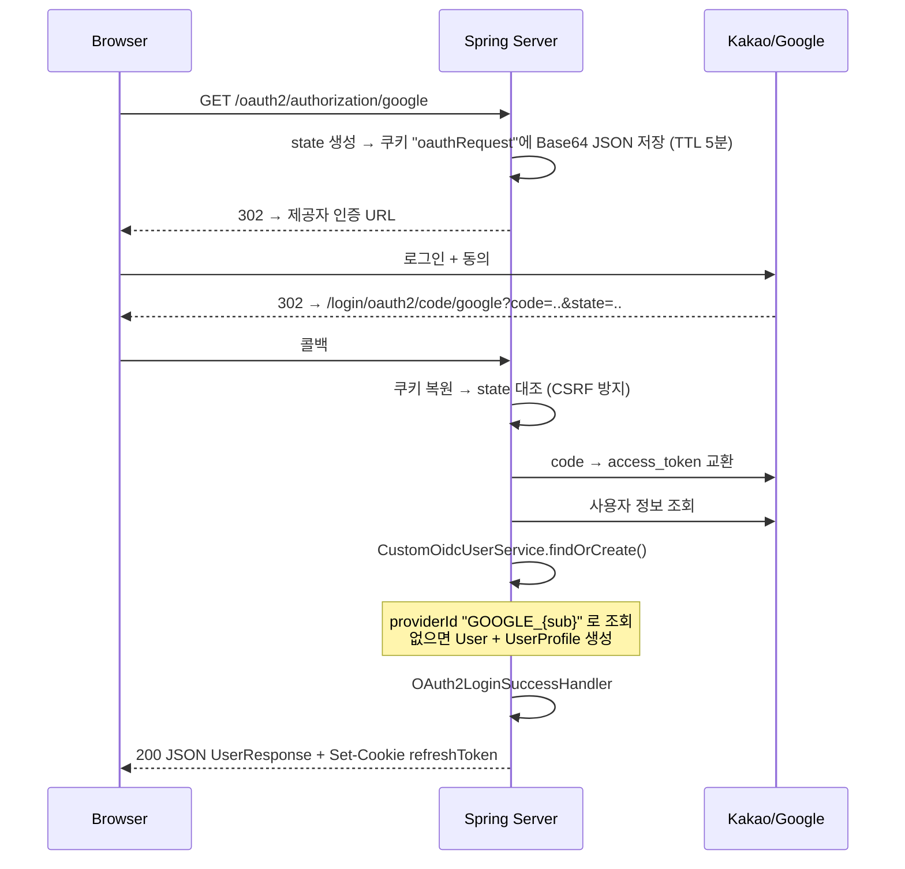

# API: 소셜 로그인

**두 가지 구현이 공존**한다. 신규 개발은 표준 방식(A)을 쓴다.

| | A. Spring Security 표준 | B. 수동 구현 (레거시) |
|---|---|---|
| 패키지 | `auth/oauth2` | `auth/oauth` |
| 진입점 | `/oauth2/authorization/{kakao\|google}` | `/api/oauth/kakao/login` |
| 지원 | 카카오 + **구글(OIDC)** | 카카오만 |
| 상태 | ✅ 현행 | ⚠️ 유지보수 중단, 쿠키 버그 있음 |

---

## A. 표준 방식 (권장)

### GET `/oauth2/authorization/kakao`
### GET `/oauth2/authorization/google`

브라우저를 이 URL로 **이동**시킨다 (fetch/XHR 불가 — 리다이렉트 체인이므로).

```js
window.location.href = 'http://localhost:8090/oauth2/authorization/google';
```

### 흐름



### 최종 응답 `200 OK`

`OAuth2LoginSuccessHandler`가 **리다이렉트가 아니라 JSON을 직접 write** 한다.

```json
{
  "id": 5,
  "email": "user@gmail.com",
  "nickName": "홍길동",
  "accessToken": "Bearer eyJhbGciOiJIUzI1NiJ9...",
  "refreshToken": "3f2a9c1b-...",
  "role": null
}
```

```http
Set-Cookie: refreshToken=...; Path=/api/auth; HttpOnly; SameSite=Strict
```

> 🚨 **프론트엔드 관점의 문제**: 브라우저가 이 URL로 이동한 상태이므로, 응답 JSON이 **화면에 그대로 출력**된다.
> SPA에서 토큰을 받으려면 SuccessHandler를 프론트엔드 URL로 리다이렉트하도록 바꿔야 한다.
> → [[알려진-이슈]], [[토큰-저장-전략]]

### 실패 응답

`OAuth2LoginFailureHandler`

| 상태 | code | 조건 |
|---|---|---|
| 401 | `LOGIN_FAILED` | 일반 인증 실패 |
| 409 | `DUPLICATE_USER_EMAIL` | 동일 이메일이 이미 다른 방식으로 가입됨 |

### 제공자별 설정

`application.yaml`

| 제공자 | registration id | scope | 고유 ID 속성 |
|---|---|---|---|
| 카카오 | `kakao` | `profile_nickname` | `id` |
| 구글 | `google` | `openid, profile, email` | `sub` (OIDC) |

카카오는 `provider` 블록(authorization-uri, token-uri, user-info-uri, `user-name-attribute: id`)을 직접 지정한다.
구글은 Spring Boot 내장 기본값을 쓴다.

> ⚠️ 카카오 scope가 `profile_nickname`뿐이라 **이메일이 내려오지 않을 수 있다**.
> `User.email`은 NOT NULL이므로 이 경우 저장에 실패한다. 카카오 개발자 콘솔에서 이메일 동의항목을 켜고 scope에 추가해야 한다.

### 사용자 매핑 규칙

`CustomOAuth2UserService.findOrCreate()`

```
providerId = "{PROVIDER}_{고유ID}"     예: "KAKAO_123456", "GOOGLE_117..."
```

1. `userRepository.findByProviderId(providerId)` 조회
2. 없으면 → `verifySocialEmail(email)`로 이메일 중복 확인 → `User` 생성
   - `password` = 랜덤 UUID의 BCrypt 해시 (폼 로그인 불가)
   - `nickName` = 카카오 `kakao_account.profile.nickname` / 구글 `name`
   - `profileImageUrl` = 카카오 `profile_image_url` / 구글 `picture`
3. `UserProfile`이 없으면 함께 생성

### state 저장 방식

`CustomOAuth2AuthorizationRequestRepository` — 세션 대신 **쿠키**를 쓴다 (STATELESS 유지).

| 항목 | 값 |
|---|---|
| 쿠키명 | `oauthRequest` |
| 값 | `StoredRequest` record를 JSON → Base64 URL 인코딩 |
| 속성 | HttpOnly, SameSite=Lax, Path=`/`, TTL 5분 |
| 콜백 시 | `removeAuthorizationRequest()`에서 즉시 만료 |

---

## B. 수동 구현 (레거시)

`auth/oauth/KakaoOAuthController.java` — `/api/oauth/kakao`

### GET `/api/oauth/kakao/login`

```http
302 Found
Location: https://kauth.kakao.com/oauth/authorize?client_id=..&redirect_uri=..&response_type=code&state={uuid}
Set-Cookie: oauthState={uuid}; Path=/api/oauth/kakao; HttpOnly; SameSite=Lax; Max-Age=300
```

### GET `/api/oauth/kakao/callback`

| 파라미터 | 필수 | |
|---|---|---|
| `code` | ✅ | 인가 코드 |
| `state` | ❌ | |
| `error` | ❌ | 제공자 오류 |

응답: `200 OK` + `UserResponse` (로그인과 동일 형태)

| 상태 | code | 조건 |
|---|---|---|
| 401 | `LOGIN_FAILED` | `error` 있음 / `code` 없음 / 토큰 교환·사용자조회 실패 |
| 401 | `INVALID_OAUTH_STATE` | `oauthState` 쿠키 없음 |

### ⚠️ 알려진 결함

1. **Refresh 쿠키가 응답에 붙지 않는다.** `ResponseCookie`를 만들고 `ResponseEntity`에 헤더로 추가하지 않는다.
   ```java
   ResponseCookie cookie = refreshCookieFactory.create(...);  // 만들기만 함
   return ResponseEntity.ok().body(response);                 // 쿠키 누락!
   ```
2. **state 값 대조를 하지 않는다.** 쿠키 존재 여부만 확인하고 `state` 파라미터와 비교하지 않는다 → CSRF 방어 불완전.
3. `KakaoOAuthService.login()`에 `System.out.println` 디버그 코드가 남아 있다.

→ [[알려진-이슈]]

### 관련 설정 (`app.oauth.kakao`)

`KakaoOAuthProperties`는 `@PostConstruct`에서 값을 검증하고, 미해결(`${...}` 잔존) 시 애플리케이션 기동을 실패시킨다.
→ `.env`에 `KAKAO_REST_API`, `KAKAO_SECRET`, `KAKAO_CALLBACK`이 반드시 있어야 한다. [[환경변수]]

---

## 어느 쪽을 쓸 것인가

| 상황 | 선택 |
|---|---|
| 신규 프론트엔드 | **A (표준)**. 단 SuccessHandler를 리다이렉트 방식으로 수정 필요 |
| 구글 로그인 | A만 가능 |
| 레거시 유지 | B는 삭제 후보 |

## 관련 문서

- [[인증-인가-아키텍처]]
- [[API-Auth]]
- [[토큰-저장-전략]]
- [[환경변수]]
