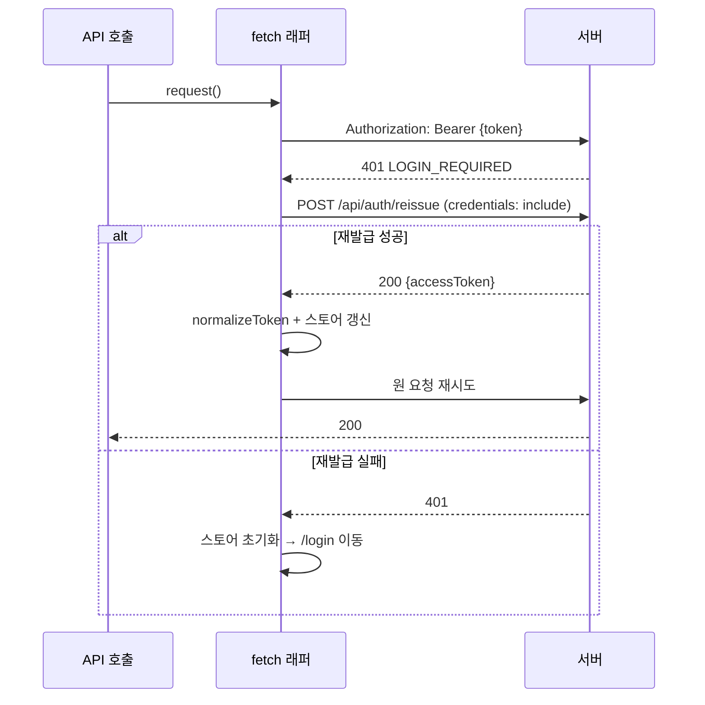

# 토큰 저장 전략

## 서버가 주는 것

| 토큰 | 전달 방식 | 수명 | JS 접근 |
|---|---|---|---|
| **Access Token** (JWT) | 응답 바디 `accessToken` | 1시간 | ✅ 가능 |
| **Refresh Token** (UUID) | `Set-Cookie` HttpOnly + 바디 `refreshToken` | 10시간 | ❌ 쿠키는 불가 |

```http
Set-Cookie: refreshToken={uuid}; Max-Age=36000; Path=/api/auth; HttpOnly; SameSite=Strict
```

> 바디의 `refreshToken`은 디버그용이다. **쿠키만 사용**하고 바디 값은 무시한다.

---

## 🚧 선행 과제: 쿠키가 전송되지 않는 문제

현재 쿠키 설정은 **같은 오리진**을 전제로 한다. `localhost:3000` → `localhost:8090` 구성에서는 문제가 생긴다.

| 속성 | 현재 값 | 문제 |
|---|---|---|
| `SameSite` | `Strict` | 크로스 사이트 요청에 쿠키가 붙지 않음 |
| `secure` | `false` | `SameSite=None`으로 바꾸려면 `true`+HTTPS 필요 |
| `Path` | `/api/auth` | 이 경로 요청에만 전송 (reissue/logout에는 충분) |

### 해결 옵션

| 방법 | 설정 | 비고 |
|---|---|---|
| **A. 프록시 (권장, 개발)** | Vite `server.proxy` / Next.js `rewrites`로 `/api` → `:8090` | 브라우저 입장에서 동일 오리진 → 쿠키·CORS 문제 동시 해결 |
| B. 쿠키 완화 | `same-site: Lax`, 프론트/백을 같은 사이트로 | localhost 포트만 다르면 same-site로 취급됨 |
| C. HTTPS + None | `secure: true`, `same-site: None` | 운영 환경(별도 도메인)에서 필요 |

`.env`/`application.yaml`의 `app.refresh-cookie.*`를 환경별로 분리한다. → [[환경변수]]

`Path=/api/auth` 유지 시, **모든 요청이 아니라 `/api/auth/*` 요청에만** 쿠키가 붙는다.
`reissue`/`logout`만 쿠키를 필요로 하므로 그대로 두어도 무방하다.

---

## Access Token 저장 위치

| 방식 | XSS | CSRF | 새로고침 유지 | 평가 |
|---|---|---|---|---|
| **메모리 (변수/스토어)** | ✅ 안전 | ✅ | ❌ 소실 | **권장** — reissue로 복원 |
| `localStorage` | ❌ 탈취 가능 | ✅ | ✅ | 흔하지만 위험 |
| `sessionStorage` | ❌ | ✅ | 탭 한정 | |
| HttpOnly 쿠키 | ✅ | ❌ | ✅ | 서버가 지원하지 않음 |

### 권장: 메모리 + 부팅 시 재발급

```
앱 시작
  ↓
메모리에 토큰 없음
  ↓
POST /api/auth/reissue  (Refresh 쿠키 자동 전송)
  ├─ 200 → accessToken 메모리 저장 → 로그인 상태 복원
  └─ 401 → 비로그인 상태
```

XSS로 토큰이 유출되지 않고, 새로고침해도 세션이 유지된다.

```ts
// authStore.ts (Zustand 예시)
interface AuthState {
  accessToken: string | null;   // 메모리에만 존재
  user: { id: number; nickName: string } | null;
  setAuth: (token: string, user: AuthState['user']) => void;
  clear: () => void;
}
```

### 🚧 사용자 정보 복원 문제

`reissue`는 **토큰만** 돌려준다. `id`, `nickName`이 없다.
`GET /api/user/me`도 현재 동작하지 않으므로 새로고침 후 사용자 정보를 복원할 방법이 없다.

| 대응 | 내용 |
|---|---|
| A (권장) | `GET /api/user/me` 복구 → 부팅 시 reissue 후 호출. [[API-User]] |
| B (임시) | `id`/`nickName`만 `localStorage`에 저장 (민감정보 아님). 토큰은 여전히 메모리 |

B를 쓰더라도 **토큰은 절대 localStorage에 넣지 않는다.**

---

## 요청 헤더 조립

⚠️ 두 엔드포인트의 형식이 다르다.

| 출처 | 값 |
|---|---|
| `POST /api/auth/login` | `"Bearer eyJhbGciOi..."` — 접두사 **포함** |
| `POST /api/auth/reissue` | `"eyJhbGciOi..."` — 접두사 **없음** |

저장 시 정규화한다.

```ts
/** 항상 "Bearer xxx" 형태로 통일 */
export const normalizeToken = (t: string) =>
  t.startsWith('Bearer ') ? t : `Bearer ${t}`;
```

이후 헤더는 그대로 넣는다.

```ts
headers: { Authorization: accessToken }   // 이미 "Bearer " 포함
```

---

## 자동 갱신 흐름



### 주의사항

1. **무한 루프 방지** — 재시도는 요청당 **1회**로 제한한다.
2. **동시 요청 중복 갱신 방지** — 여러 요청이 동시에 401을 받으면 reissue가 여러 번 호출된다. 진행 중인 Promise를 공유한다.
3. **reissue 자체의 401은 재시도하지 않는다.**

구현 코드는 [[API-클라이언트-가이드]] 참조.

---

## 소셜 로그인 토큰 수신 🚧

현재 `OAuth2LoginSuccessHandler`는 **JSON을 브라우저에 직접 출력**한다.
브라우저가 해당 URL로 이동한 상태이므로 SPA가 토큰을 받을 수 없다.

### 수정 방향

```java
// OAuth2LoginSuccessHandler — 리다이렉트 방식으로 변경
String redirect = UriComponentsBuilder
    .fromUriString(frontendUrl + "/oauth/callback")
    .fragment("accessToken=" + accessToken)   // 쿼리스트링보다 fragment가 로그에 안 남음
    .build().toUriString();
response.sendRedirect(redirect);
```

프론트엔드 `/oauth/callback`:

```ts
const params = new URLSearchParams(window.location.hash.slice(1));
const token = params.get('accessToken');
if (token) {
  setAuth(normalizeToken(token), null);
  window.history.replaceState(null, '', '/');  // fragment 제거
  navigate('/');
}
```

Refresh 쿠키는 리다이렉트 응답에도 함께 실리므로 그대로 동작한다.

---

## 로그아웃 처리

```ts
await api.post('/api/auth/logout');   // credentials: include (쿠키 전송)
authStore.clear();                     // 메모리 토큰 제거
queryClient.clear();                   // 캐시된 서버 상태 제거
navigate('/login');
```

⚠️ **Access Token은 서버에서 무효화되지 않는다.** 블랙리스트가 없어 만료(최대 1시간)까지 유효하다.
클라이언트에서 폐기하는 것으로 충분하다고 보되, 보안 요구가 높다면 서버에 블랙리스트 도입이 필요하다.

---

## 서버측 제약 요약

| 제약 | 영향 |
|---|---|
| Refresh Token 사용자당 1개 (`user_id` UNIQUE) | 다른 기기 로그인 시 기존 세션 무효화 |
| Refresh Token 회전 없음 | 탈취 시 만료까지 유효 |
| Access Token 블랙리스트 없음 | 로그아웃 후에도 만료 전까지 유효 |
| JWT에 role 클레임 없음 | 매 요청 DB 조회 / 클라이언트가 role을 알 수 없음 |

→ [[엔티티-RefreshToken]], [[인증-인가-아키텍처]], [[알려진-이슈]]

## 관련 문서

- [[API-Auth]] · [[API-OAuth]]
- [[API-클라이언트-가이드]]
