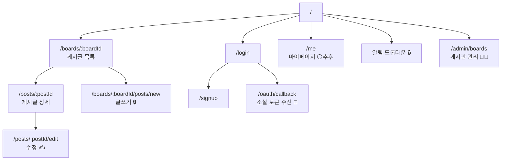

# 화면 정의서

[[프론트엔드-요구사항]]의 FR을 화면 단위로 재구성한 문서.

## 라우트 맵



| 기호 | 의미 |
|---|---|
| 🔒 | 로그인 필요 |
| ✍️ | 작성자만 |
| 👑 | ADMIN |
| 🚧 | 백엔드 수정 필요 |
| ⚪ | 추후 구현 예정 (현 단계 제외) |

---

## 공통 레이아웃

### 헤더 (모든 화면)

| 요소 | 데이터 | API |
|---|---|---|
| 로고 → `/` | — | — |
| 게시판 탭/드롭다운 | `BoardResponse[]` | `GET /api/board/all` |
| 알림 벨 + 뱃지 🔒 | `{count}` | `GET /api/notify/unreads` (30초 폴링) |
| 닉네임 | 로그인 응답의 `nickName` | (`/api/user/me` 구현 전까지 클라이언트 보관) |
| 로그인/로그아웃 | — | `POST /api/auth/logout` |

---

## SCR-01 메인 `/`

게시판 목록 + 최근 글 요약.

| 영역 | API | 비고 |
|---|---|---|
| 게시판 카드 목록 | `GET /api/board/all` | `name`, `description` 표시 |
| 최근 글 | `GET /api/post/{boardId}/all?size=5` | 게시판별 상위 5건 |

> `GET /api/post/all`은 페이징이 없고 본문을 전부 포함하므로 **사용하지 않는다**.

---

## SCR-02 게시글 목록 `/boards/:boardId`

| 항목 | 내용 |
|---|---|
| API | `GET /api/post/{boardId}/all?page=&size=10&sort=createdAt,DESC` |
| 응답 | `Page<PostDTO>` → [[API-페이지네이션]] |

### 리스트 항목 표시

| 표시 | 필드 | 주의 |
|---|---|---|
| 제목 | `title` | |
| 작성자 | `author` | 닉네임 문자열 (프로필 링크 불가) |
| 조회수 | `viewCount` | |
| 작성일 | `createdAt` | ISO 문자열 → 상대시간 포맷 |
| 이미지 뱃지 | `images.length > 0` | 썸네일 URL은 `images[0].url` |
| 좋아요 | `like` / `disLike` | 목록 응답에 포함됨. `myReaction`으로 내 반응 표시 가능 |

### 상호작용

- 페이지네이션 (0-based) 또는 무한 스크롤
- 정렬 토글: 최신순 / 조회순 (`?sort=viewCount,DESC`)
- 글쓰기 버튼 🔒 → `/boards/:boardId/posts/new`
- 빈 상태: "아직 게시글이 없습니다"

⚠️ 없는 boardId도 빈 페이지가 오므로, 게시판 이름은 `/api/board/all` 결과에서 찾아 표시하고 없으면 404 화면.

---

## SCR-03 게시글 상세 `/posts/:postId`

| 항목 | 내용 |
|---|---|
| API | `GET /api/post/{id}` (**로그인 시 토큰 필수** — `canEdit` 계산 + 조회수) |
| 댓글 | `GET /api/comment/post/{postId}/list` |

### 레이아웃

```
┌─────────────────────────────────────┐
│ [게시판명]  제목                     │  ← board는 문자열, 링크 불가
│ 작성자 · 작성일 · 조회수 N            │
│                          [수정][삭제] │  ← canEdit / canDelete
├─────────────────────────────────────┤
│ 본문 (body)                          │
│ 이미지 갤러리 (sortOrder 순)          │
├─────────────────────────────────────┤
│ [👍 좋아요 12] [👎 싫어요 1]          │
├─────────────────────────────────────┤
│ 댓글 N개                             │
│  └ 댓글 / 대댓글 트리                 │
│ [댓글 입력]                          │
└─────────────────────────────────────┘
```

### 이미지 갤러리

```tsx
{post.images.map(img => (
  
))}
```

이미 `sortOrder` 순으로 정렬되어 온다.

### 반응 버튼

`POST /api/post/{postId}/reation` — 경로 오타 주의(`reation`).
초기 카운트와 내 반응은 상세 조회 응답의 `like`/`disLike`/`myReaction`에 이미 들어있다.
클릭 후에는 응답으로 해당 항목만 갱신한다. → [[API-Reaction]]

### 댓글 영역

| 항목 | 내용 |
|---|---|
| 페이징 단위 | 최상위 댓글 (대댓글은 `children`에 전부 포함) |
| 삭제된 댓글 | `deleted: true` → 회색 + 버튼 숨김 |
| 답글 버튼 | **최상위 댓글에만** 노출 (깊이 2 제한) |
| 내 댓글 판별 | 🚧 작성자 ID가 없음 → 닉네임 비교 (불완전) |
| 수정 | ✅ 동작. 삭제된 댓글만 400 |
| 반응 | ✅ `likeCount`/`dislikeCount`/`myReaction` 포함. 토글은 `POST /api/comment/{id}/reaction` |

---

## SCR-04 게시글 작성 `/boards/:boardId/posts/new` 🔒

| 항목 | 내용 |
|---|---|
| API | `POST /api/post/{boardId}/new` (`multipart/form-data`) |

### 폼

| 필드 | 검증 | 에러 문구 |
|---|---|---|
| 제목 | **5~200자** | "제목은 5자 이상 200자 이하로 입력하세요" |
| 본문 | 필수 | "본문을 입력하세요" |
| 이미지 | 0~5장, 각 2MB, png/jpg/jpeg/gif/webp | "이미지는 최대 5장까지 첨부할 수 있습니다" |

### 이미지 업로더

- 드래그앤드롭 + 파일 선택
- 미리보기(`URL.createObjectURL`) + 개별 삭제
- 전송 순서 = `sortOrder`
- 클라이언트에서 크기·타입 사전 검증 (서버 400 방지)

### 전송

```js
const fd = new FormData();
fd.append('post', new Blob([JSON.stringify({ title, body })], { type: 'application/json' }));
images.forEach(f => fd.append('images', f));
// Content-Type 헤더는 설정하지 않는다
```

성공 → `/posts/{id}` 이동.

---

## SCR-05 게시글 수정 `/posts/:postId/edit` ✍️

| 항목 | 내용 |
|---|---|
| 초기값 | `GET /api/post/{id}` |
| 저장 | `PUT /api/post/{id}/update` (**JSON**, multipart 아님) |
| 수정 가능 | 제목, 본문만 |

🚧 기존 이미지는 **읽기 전용**으로 표시하고 "이미지는 수정할 수 없습니다" 안내를 넣는다.

진입 시 `canEdit`이 false면 접근 차단.

---

## SCR-06 로그인 `/login`

| 항목 | 내용 |
|---|---|
| API | `POST /api/auth/login` |
| 필드 | 이메일, 비밀번호(8자 이상) |
| 소셜 | 카카오 / 구글 버튼 → `window.location.href` |

실패(401 `LOGIN_REQUIRED`) → "이메일 또는 비밀번호가 올바르지 않습니다"

---

## SCR-07 회원가입 `/signup`

| 필드 | 검증 |
|---|---|
| 이메일 | 형식 (**클라이언트에서만** 검증됨) |
| 비밀번호 | 8~30자 |
| 비밀번호 확인 | 일치 |
| 닉네임 | 필수 |

전송 시 키는 `nick_name`, `role`은 `"USER"` 고정.
409 `DUPLICATE_USER_EMAIL` → 이메일 필드 에러.

---

## SCR-08 소셜 콜백 `/oauth/callback` 🚧

현재 백엔드는 소셜 로그인 성공 시 **JSON을 화면에 출력**한다.
`OAuth2LoginSuccessHandler`를 프론트엔드 URL로 리다이렉트하도록 수정한 뒤, 이 화면에서 토큰을 수신한다.

→ [[API-OAuth]], [[토큰-저장-전략]]

---

## SCR-09 알림 드롭다운 🔒

헤더 벨 아이콘 클릭 시 열린다.

| 동작 | API |
|---|---|
| 뱃지 개수 | `GET /api/notify/unreads` (30초 폴링) |
| 목록 | `GET /api/notify/list?page=0&size=10` (열 때만) |
| 항목 클릭 | `PUT /api/notify/{id}/read` → `/posts/{postId}` 이동 |

`message`를 그대로 표시하면 된다 (서버가 한국어 문장 생성).
읽지 않은 항목은 배경 강조.
⚠️ 대상 게시글이 삭제됐을 수 있다 → 404 처리.

🚧 "모두 읽음" 버튼은 API가 없다.

---

## SCR-10 마이페이지 `/me` ⚪ 추후

`GET /api/user/me`는 **추후 구현 예정**으로 결정됨 → 현 단계에서는 만들지 않는다.
복구 후에도 프로필 수정 API가 없어 조회 전용 화면만 가능하다. → [[API-User]]

---

## SCR-11 게시판 관리 `/admin/boards` 👑🚧

| 동작 | API |
|---|---|
| 목록 | `GET /api/board/all` |
| 생성 | `POST /api/board/new` |
| 수정 | `PUT /api/board/{id}/update` |
| 삭제 | `DELETE /api/board/{id}` |

🚧 ADMIN 여부를 알 수 없으므로 메뉴에 노출하지 않고 직접 URL 접근으로만 사용한다.
403이 오면 접근 거부 화면.
⚠️ 삭제는 게시글이 있으면 실패한다. 응답이 plain text `"ok"`인 점 주의.

---

## 화면 ↔ API 매트릭스

| 화면 | 필요한 API |
|---|---|
| 공통 헤더 | `/api/board/all`, `/api/notify/unreads` |
| SCR-01 메인 | `/api/board/all`, `/api/post/{boardId}/all` |
| SCR-02 목록 | `/api/post/{boardId}/all` |
| SCR-03 상세 | `/api/post/{id}`, `/api/comment/post/{postId}/list`, `/api/post/{id}/reation`, `/api/comment/{id}/reaction` |
| SCR-04 작성 | `/api/post/{boardId}/new` |
| SCR-05 수정 | `/api/post/{id}`, `/api/post/{id}/update` |
| SCR-06 로그인 | `/api/auth/login`, `/oauth2/authorization/*` |
| SCR-07 가입 | `/api/auth/signup` |
| SCR-09 알림 | `/api/notify/list`, `/api/notify/{id}/read` |
| SCR-10 마이페이지 | `/api/user/me` ⚪ 추후 |
| SCR-11 관리 | `/api/board/*` |

## 관련 문서

- [[프론트엔드-요구사항]]
- [[프론트엔드-데이터-모델]]
- [[API-개요]]
