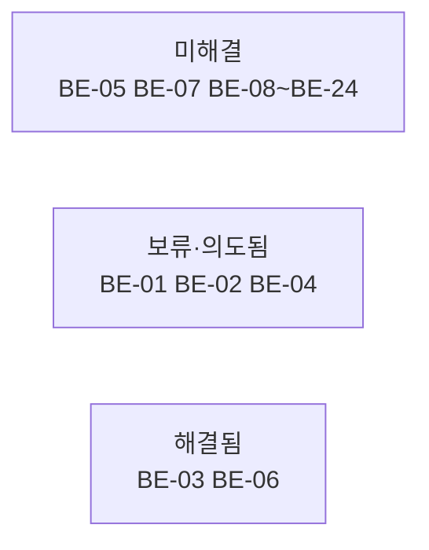

# 알려진 이슈

코드 분석 시점(2026-08-01) 기준. **버그를 고치면 해당 항목을 이 문서에서 제거**한다.

## 우선순위 요약



### 상태 범례

| 상태 | 의미 |
|---|---|
| 🔵 **해결됨** | 수정 완료. 다음 정리 때 항목 삭제 |
| ⏸ **보류** | 팀에서 인지하고 추후 처리하기로 결정 |
| ⚪ **의도됨** | 버그가 아님. 현 단계에서 의도한 동작 |

| ID | 제목 | 심각도 | 영역 |
|---|---|---|---|
| **BE-01** | CORS 미설정 | ⏸ 보류 (추후) | 프론트엔드 차단 |
| **BE-02** | 회원가입 시 role을 클라이언트가 지정 | ⚪ 의도됨 (테스트 편의) | 보안 |
| **BE-03** | ~~댓글 수정 로직 반전~~ | 🔵 **해결됨** | — |
| **BE-04** | `GET /api/user/me` 미동작 | ⚪ 의도됨 (추후 구현) | 기능 |
| **BE-05** | JWT 시크릿 하드코딩 | 🟠 P1 | 보안 |
| **BE-06** | ~~반응 정보가 조회 API에 없음~~ | 🔵 **해결됨** | — |
| **BE-06b** | 삭제된 댓글에도 반응 가능 | 🟢 P3 | 도메인 규칙 |
| **BE-07** | 반응 API 경로 오타 `reation` | 🟠 P1 | API |
| **BE-08** | 로그인 응답 `role`이 항상 null | 🟠 P1 | 기능 미완 |
| **BE-09** | 소셜 로그인 성공 시 JSON 직접 출력 | 🟠 P1 | 프론트엔드 |
| **BE-10** | 댓글/게시글 응답에 작성자 ID 없음 | 🟠 P1 | 기능 미완 |
| **BE-11** | 레거시 카카오 콜백에서 쿠키 누락 + state 미검증 | 🟡 P2 | 보안/레거시 |
| **BE-12** | 토큰 값이 DEBUG 로그에 출력 | 🟡 P2 | 보안 |
| **BE-13** | `@Valid` 실패 시 필드 정보 손실 | 🟡 P2 | DX |
| **BE-14** | `updated_at` 자동 갱신 누락 (5개 엔티티) | 🟡 P2 | 데이터 |
| **BE-15** | 게시글 삭제 시 디스크 파일 잔존 | 🟡 P2 | 스토리지 |
| **BE-16** | 게시글 수정 시 이미지 변경 불가 | 🟡 P2 | 기능 미완 |
| **BE-17** | `METHOD_NOT_ALLOWED` 상태코드 불일치 | 🟡 P2 | API |
| **BE-18** | 알림 조회 시 부정확한 ErrorCode | 🟢 P3 | 사소 |
| **BE-19** | Refresh Token 회전 없음 / 단일 세션 | 🟡 P2 | 보안 |
| **BE-20** | 미사용 코드 다수 | 🟢 P3 | 정리 |
| **BE-21** | `uploads/`가 gitignore에 없음 | 🟡 P2 | 저장소 |
| **BE-22** | 카카오 scope에 이메일 없음 | 🟠 P1 | 소셜 로그인 |
| **BE-23** | DB 접속정보 하드코딩 | 🟡 P2 | 운영 |
| **BE-24** | 테스트 부재 | 🟡 P2 | 품질 |
| **BE-25** | `/error`가 permitAll 아님 → 예외가 401로 위장 | 🟠 P1 | 예외 처리 |

---

## BE-01 — CORS 미설정 ⏸ 보류

> **결정(2026-08-01)**: 추후 처리하기로 함. 프론트엔드 착수 시점에 아래 설정을 적용하거나,
> 그 전까지는 개발 서버 프록시로 우회한다. → [[API-클라이언트-가이드]]

**증상**: 브라우저에서 다른 오리진(예: `localhost:3000`)으로부터의 모든 API 호출이 차단된다.

**원인**: `SecurityConfig`에 `.cors(...)`가 없고, `WebConfig`에 `addCorsMappings()`도 없다.

**해결**

```java
// SecurityConfig
@Bean
public CorsConfigurationSource corsConfigurationSource() {
    CorsConfiguration c = new CorsConfiguration();
    c.setAllowedOrigins(List.of("http://localhost:3000"));   // 운영에서는 실제 도메인
    c.setAllowedMethods(List.of("GET","POST","PUT","DELETE","OPTIONS"));
    c.setAllowedHeaders(List.of("*"));
    c.setAllowCredentials(true);        // 쿠키 전송에 필수
    c.setExposedHeaders(List.of("Set-Cookie"));
    UrlBasedCorsConfigurationSource src = new UrlBasedCorsConfigurationSource();
    src.registerCorsConfiguration("/**", c);
    return src;
}
// 필터체인에 추가
http.cors(Customizer.withDefaults())
```

**임시 우회**: 프론트엔드 개발 서버 프록시 사용 → [[API-클라이언트-가이드]]

관련: [[프론트엔드-요구사항]] P-1

---

## BE-02 — 회원가입 시 role을 클라이언트가 지정 ⚪ 의도됨

> **결정(2026-08-01)**: 테스트 편의를 위해 의도적으로 열어둔 기능. 현 단계에서는 버그로 취급하지 않는다.
> 다만 **운영 배포 전에는 반드시 닫아야 한다.**

**현재 동작**: `{"role":"ADMIN"}`으로 가입하면 관리자가 된다. ADMIN 계정을 API만으로 만들 수 있어
[[로컬-실행-가이드]]의 초기 데이터 세팅이 간단해진다.

**위치**: `auth/AuthService.java`

```java
user.setRole(request.getRole().equals("ADMIN") ? User.Role.ADMIN : User.Role.USER);
```

**운영 전 조치**: `SignupRequest`에서 `role` 필드 제거, 서버에서 항상 `User.Role.USER` 부여.
관리자 승격은 별도 관리 API 또는 DB 직접 수정으로.

관련: [[엔티티-User]], [[API-Auth]]

---

## BE-03 — 댓글 수정 로직 반전 🔵 해결됨 (2026-08-01)

**증상이었던 것**: 정상 댓글을 수정하면 400 `CANNOT_EDIT_DELETED`가 반환됐다.
`comment/CommentService.update()`의 조건이 반전되어 있었다.

**적용된 수정**

```java
// 삭제된(soft delete) 댓글은 수정할 수 없다
if ( comment.isDeleted() ) {
    throw new BusinessException(ErrorCode.CANNOT_EDIT_DELETED);
}

comment.update(request.getContent());   // setContent() 대신 도메인 메서드 사용
```

**검증**: 정상 댓글 수정 → 200 + 수정된 내용 반환 / 삭제된 댓글 수정 → 400 `CANNOT_EDIT_DELETED`.

관련: [[API-Comment]], [[엔티티-Comment]]

---

## BE-04 — `GET /api/user/me` 미동작 ⚪ 의도됨

> **결정(2026-08-01)**: `WebConfig`의 `addArgumentResolvers()` 주석 처리는 의도된 상태이며,
> 프로필 기능은 **추후 구현 예정**이다. 현 단계에서 버그로 취급하지 않는다.
> 아래는 되살릴 때 참고할 내용.

**현재 동작**: 500 또는 `LOGIN_REQUIRED`. 프로필 조회 불가.

**원인 (2중)**

1. `WebConfig.addArgumentResolvers()`가 주석 처리되어 `LoginUserIdResolver`가 등록되지 않음
   → `@LoginUserId Long loginUserId`가 일반 쿼리 파라미터로 취급되어 null
2. 리졸버를 되살려도 동작 안 함 — `request.getAttribute("LoginUserId")`를 설정하는 필터가 없다
   (`JwtAuthenticationFilter`는 `SecurityContext`만 채운다)

**해결**: 다른 컨트롤러와 동일하게 `@AuthenticationPrincipal`로 전환.

```java
@GetMapping("/me")
public UserProfileResponse me(@AuthenticationPrincipal CustomUserDetails userDetails) {
    return userProfileService.me(userDetails.getId());
}
```

`@LoginUserId`, `LoginUserIdResolver`는 삭제 후보.

관련: [[API-User]]

---

## BE-05 — JWT 시크릿 하드코딩 🟠

**위치**: `application.yaml`

```yaml
jwt.secret: c2VjcmV0X2tleV9ieV9zYnNfYWNhZGVteV8yMDI2MDcyMV9ib2FyZF9iYWNrX2VuZF9hcHA=
```

Git에 커밋되어 있고 Base64 디코딩하면 평문이 드러난다.

**해결**: `${JWT_SECRET}`으로 외부화 + 값 교체 + 커밋 이력 정리 검토.

관련: [[환경변수]]

---

## BE-06 — 반응 정보가 조회 API에 없음 🔵 해결됨 (2026-08-01)

게시글·댓글 조회 응답에 좋아요/싫어요 개수와 본인 반응이 포함되도록 연동했다.
**N+1을 피하기 위해 배치 집계**를 사용한다.

### 적용 내용

| 대상 | 변경 |
|---|---|
| `PostDTO.like` / `disLike` / `myReaction` | 상세·목록 모두 실제 값이 채워짐 |
| `CommentResponse` | `likeCount`, `dislikeCount`, `myReaction` 컴포넌트 추가 |
| `Comment.toResponse()` | `Map<Long, ReactionResponse>`를 받는 오버로드 추가 (`Post.toDTO`와 동일한 패턴) |
| 조회 컨트롤러 | `@AuthenticationPrincipal`로 viewer id를 받아 `myReaction` 계산 (비로그인 시 null) |

### 배치 집계

`ReactionService.summarizePostReactions()` / `summarizeCommentReactions()`
→ 공통 `mergeSummaries()`로 `targetId -> ReactionResponse` 맵 생성.

```java
// PostReactionRepository / CommentReactionRepository
@Query("SELECT new ...ReactionCount(pr.post.id, pr.type, COUNT(pr)) " +
       "FROM PostReaction pr WHERE pr.post.id IN :postIds GROUP BY pr.post.id, pr.type")
```

**대상이 몇 개든 쿼리 2회**(개수 집계 1 + 본인 반응 1). 비로그인이면 1회.

### 검증 결과

| 요청 | 전체 SQL | 반응 관련 SQL |
|---|---|---|
| 댓글 6개 목록 | 6 | **2** |
| 게시글 4개 목록 | 5 | **2** (`IN (?,?,?,?)`) |

관련: [[API-Reaction]], [[엔티티-Reaction]], [[API-Comment]], [[API-Post]]

---

## BE-06b — 삭제된 댓글에도 반응 가능 🟢

`ReactionService.reactToComment()`는 `commentRepository.existsById()`로 존재 여부만 확인하고
`deleted` 플래그는 검사하지 않는다 (게시글 로직을 그대로 대응시킨 결과).

→ soft delete된 댓글("삭제된 게시글입니다"로 표시되는 댓글)에도 좋아요를 남길 수 있다.

**해결**: 차단이 필요하면 `CANNOT_REACT_TO_DELETED` ErrorCode를 추가하고
`existsById` 대신 엔티티를 로딩해 `isDeleted()`를 검사한다.

관련: [[API-Reaction]], [[엔티티-Comment]]

---

## BE-07 — 반응 API 경로 오타 🟠

**위치**: `reaction/ReactionController.java`

```java
@PostMapping("/post/{postId}/reation")   // reaction 오타
```

또한 `@RequestMapping("/api/")`의 후행 슬래시가 다른 컨트롤러(`/api/post`)와 스타일이 다르다.

**해결**: `/api/post/{postId}/reaction`으로 수정. 프론트엔드 코드도 함께 변경.

---

## BE-08 — 로그인 응답 `role`이 항상 null 🟠

**위치**: `auth/AuthService.java` — `login()`

```java
// response.setRole(userDetails.getAuthorities());   ← 주석 처리됨
```

**영향**: 프론트엔드가 사용자의 관리자 여부를 알 수 없다 → 관리 UI 노출 판단 불가.

**해결**: `UserResponse.role`에 `user.getRole().name()`을 세팅하거나, `GET /api/user/me` 응답에 role을 포함.

관련: [[API-Auth]], [[API-Board]]

---

## BE-09 — 소셜 로그인 성공 시 JSON 직접 출력 🟠

**증상**: `/oauth2/authorization/google`로 이동하면 로그인 후 브라우저 화면에 JSON이 그대로 표시된다.
SPA가 토큰을 수신할 방법이 없다.

**위치**: `auth/oauth2/OAuth2LoginSuccessHandler.java` — `objectMapper.writeValue(response.getWriter(), userResponse)`

**해결**: 프론트엔드 콜백 URL로 리다이렉트.

```java
response.sendRedirect(frontendUrl + "/oauth/callback#accessToken=" + accessToken);
```

관련: [[API-OAuth]], [[토큰-저장-전략]]

---

## BE-10 — 응답에 작성자 ID가 없음 🟠

**증상**: 프론트엔드가 "내가 쓴 댓글"인지 판별할 수 없다. 작성자 프로필 링크도 만들 수 없다.

| DTO | 현재 | 필요 |
|---|---|---|
| `CommentResponse` | `authorUsername`(닉네임)만 | `authorId` 또는 `canEdit`/`canDelete` |
| `PostDTO` | `author`(닉네임), `board`(이름) | `authorId`, `boardId` |

`PostDTO`에 `boardId`가 없어 **게시글 상세에서 목록으로 돌아가는 링크**도 만들 수 없다.

관련: [[API-Comment]], [[API-Post]], [[프론트엔드-데이터-모델]]

---

## BE-11 — 레거시 카카오 콜백 결함 🟡

**위치**: `auth/oauth/KakaoOAuthController.callback()`

1. Refresh 쿠키를 만들고 응답에 붙이지 않는다
   ```java
   ResponseCookie cookie = refreshCookieFactory.create(...);  // 미사용
   return ResponseEntity.ok().body(response);
   ```
2. `state` 쿠키 존재만 확인하고 파라미터와 **대조하지 않는다** → CSRF 방어 불완전
3. `KakaoOAuthService.login()`에 `System.out.println` 잔존

**해결**: 표준 OAuth2(`auth/oauth2`)로 일원화하고 `auth/oauth` 패키지 삭제 검토.

---

## BE-12 — 토큰 값이 DEBUG 로그에 출력 🟡

**위치**: `auth/jwt/JwtTokenProvider.java`

```java
log.debug("JwtTokenProvider 생성됨: {}", base64Secret);   // 시크릿!
log.debug("유효한 토큰: {}", token);                      // 토큰 전문
```

`logging.level.com.sbs.board: DEBUG` 설정과 결합되어 로그에 남는다.

**해결**: 해당 로그 제거 또는 마스킹, 운영 로깅 레벨 INFO 이상.

---

## BE-13 — `@Valid` 실패 시 필드 정보 손실 🟡

**위치**: `GlobalExceptionHandler.handleBadRequestException()`

`MethodArgumentNotValidException`의 `getBindingResult()`를 사용하지 않고 `INVALID_INPUT` 하나만 반환한다.

**영향**: 프론트엔드가 어느 필드가 왜 틀렸는지 알 수 없어, 서버 검증 규칙을 클라이언트에서 중복 구현해야 한다.

**해결**

```java
List<FieldErrorDetail> errors = ex.getBindingResult().getFieldErrors().stream()
    .map(fe -> new FieldErrorDetail(fe.getField(), fe.getDefaultMessage()))
    .toList();
```

`ErrorResponse`에 `errors` 필드를 추가한다.

관련: [[예외-처리-아키텍처]], [[API-에러코드]]

---

## BE-14 — `updated_at` 자동 갱신 누락 🟡

`@LastModifiedDate`는 `@EntityListeners(AuditingEntityListener.class)`가 있어야 동작한다.

| 엔티티 | `@EntityListeners` |
|---|---|
| `User`, `UserProfile`, `Board`, `Post`, `RefreshToken` | ✅ |
| `Comment`, `PostImage`, `PostReaction`, `CommentReaction`, `Notification` | ❌ |

→ 후자 5개는 `updated_at`이 **생성 시각에 고정**된다. "수정 시각"으로 신뢰하면 안 된다.

**해결**: 5개 엔티티에 `@EntityListeners(AuditingEntityListener.class)` 추가.
근본적으로는 공통 `BaseTimeEntity`를 만들어 상속시키는 편이 낫다.

관련: [[도메인-모델]]

---

## BE-15 — 게시글 삭제 시 디스크 파일 잔존 🟡

`PostService.delete()`가 `post_images` 레코드만 cascade 삭제하고 `FileStorageService.delete()`를 호출하지 않는다.
→ `uploads/`에 고아 파일이 무한 누적된다.

**해결**: 삭제 전 `post.getImages()`를 순회하며 `fileStorageService.delete(storedName)` 호출.

관련: [[파일-업로드-아키텍처]]

---

## BE-16 — 게시글 수정 시 이미지 변경 불가 🟡

`PUT /api/post/{id}/update`는 JSON만 받고 title/body만 수정한다.
이미지 추가·삭제·순서 변경 API가 없다.

관련: [[API-Post]], [[엔티티-PostImage]]

---

## BE-17 — `METHOD_NOT_ALLOWED` 상태코드 불일치 🟡

```java
METHOD_NOT_ALLOWED(HttpStatus.BAD_REQUEST, "허용되지 않는 요청 방식입니다.")   // enum: 400
```

```java
return ResponseEntity.status(HttpStatus.METHOD_NOT_ALLOWED)                  // 응답: 405
        .body(ErrorResponse.of(METHOD_NOT_ALLOWED));
```

**해결**: enum을 `HttpStatus.METHOD_NOT_ALLOWED`로 변경.

---

## BE-18 — 알림 조회 시 부정확한 ErrorCode 🟢

`NotificationService.read()`에서 알림을 못 찾으면 `COMMENT_NOT_FOUND`("댓글을 찾을 수 없습니다")를 던진다.
`NOTIFICATION_NOT_FOUND` 추가 필요.

---

## BE-19 — Refresh Token 회전 없음 / 단일 세션 🟡

1. `reissueToken()`이 기존 Refresh Token을 그대로 반환 → 탈취 시 만료(10시간)까지 유효
2. `refresh_token.user_id`가 UNIQUE → 다른 기기 로그인 시 기존 세션 강제 종료
3. 만료 토큰 정리 배치가 없어 레코드가 누적
4. Access Token 블랙리스트가 없어 로그아웃 후에도 최대 1시간 유효

관련: [[엔티티-RefreshToken]], [[토큰-저장-전략]]

---

## BE-20 — 미사용 코드 다수 🟢

| 대상 | 상태 |
|---|---|
| `PostListResponse` | 정의만 되고 미사용 (목록도 `PostDTO` 반환) |
| `BoardDTO` | 미사용 |
| `RefreshTokenRequest` | 미사용 (쿠키 방식으로 대체) |
| `PostRepository.findDetailById` | 정의됐으나 `getPost()`는 `findById` 사용 |
| `PostRepository.findByBoard` | 미사용 |
| `PostService.validateAuthor` | 주석 처리 |
| `BoardService.validateUser` | 호출되지 않음 |
| `ErrorCode.INVALID_BOARD_ID`, `POST_ACCESS_DENIED`, `BOARD_ACCESS_DENIED` | 미사용 |
| `LoginUserId` / `LoginUserIdResolver` | 비활성 (BE-04) |
| `Comment.update()` | 정의됐으나 서비스는 `setContent()` 사용 |
| `auth/oauth` 패키지 전체 | 레거시 |
| `User.from()` | 미사용 |

---

## BE-21 — `uploads/`가 gitignore에 없음 🟡

업로드된 이미지가 저장소에 커밋될 수 있다. `.gitignore`에 `uploads/` 추가 필요.

---

## BE-22 — 카카오 scope에 이메일 없음 🟠

```yaml
kakao.scope: profile_nickname
```

`User.email`은 NOT NULL인데 카카오가 이메일을 주지 않으면 최초 로그인 시 저장 실패.

**해결**: 카카오 개발자 콘솔에서 이메일 동의항목 활성화 + `scope: profile_nickname,account_email`.
또는 이메일이 없을 때 대체값(`{providerId}@kakao.local`) 생성 로직 추가.

관련: [[API-OAuth]], [[환경변수]]

---

## BE-23 — DB 접속정보 하드코딩 🟡

`application.yaml`에 `username: root`, `password: 1234`가 그대로 있다. 환경변수로 분리 필요.

관련: [[환경변수]]

---

## BE-25 — `/error`가 permitAll이 아님 → 모든 미처리 예외가 401로 위장 🟠

**증상**: `GlobalExceptionHandler`가 잡지 않는 예외가 발생하면, 실제 원인과 무관하게
**401 `LOGIN_REQUIRED` "로그인이 필요합니다."** 가 반환된다.

**재현** (실제 확인함)

```bash
# 깨진 UTF-8이 섞인 본문 전송
curl -X POST localhost:8090/api/auth/signup -H "Content-Type: application/json" -d '{...깨진 한글...}'
→ {"code":"LOGIN_REQUIRED","message":"로그인이 필요합니다.", ...}
```

서버 로그:

```
Resolved [HttpMessageNotReadableException: JSON parse error: Invalid UTF-8 middle byte 0xd7]
Securing POST /error          ← 여기서 막힘
```

**원인**

1. 미처리 예외 → Spring Boot가 `/error`로 ERROR 디스패치
2. `SecurityConfig`에 `/error` 허용 규칙이 없음 → `anyRequest().authenticated()`에 걸림
3. `RestAuthenticationEntryPoint`가 401 `LOGIN_REQUIRED` 반환

**영향**: 400이어야 할 요청 오류가 401로 보인다. 프론트엔드가 401을 받으면
[[API-클라이언트-가이드]]의 인터셉터가 토큰 재발급을 시도하고, 실패하면 **로그인 페이지로 튕긴다.**
즉 단순 입력 오류가 강제 로그아웃으로 이어질 수 있다.

**해결**

```java
.requestMatchers("/error").permitAll()
```

추가로 `GlobalExceptionHandler`에 `HttpMessageNotReadableException` 핸들러를 두면
`INVALID_INPUT`(400)으로 정확히 응답할 수 있다. BE-13과 함께 처리하면 좋다.

관련: [[예외-처리-아키텍처]], [[인증-인가-아키텍처]], [[API-에러코드]]

---

## BE-24 — 테스트 부재 🟡

`BoardApplicationTests`(컨텍스트 로딩) 하나뿐이다.
`spring-security-test` 의존성은 있으나 사용되지 않는다.

`.env`가 없으면 이 테스트조차 실패한다 (`KakaoOAuthProperties` 검증).

---

## 프론트엔드 착수 전 최소 수정 세트

BE-03(댓글 수정)과 BE-06(반응 조회)은 **해결됨**. 남은 항목은 아래와 같다.

| # | 항목 | 상태 |
|---|---|---|
| 1 | **BE-01** CORS | ⏸ 보류 — 그동안은 개발 프록시로 우회 ([[API-클라이언트-가이드]]) |
| 2 | **BE-25** `/error` permitAll | 🟠 **권장** — 미처리 예외가 401로 위장되어 강제 로그아웃을 유발 |
| 3 | **BE-08** 로그인 응답 `role` | 🟠 관리 UI 노출 판단에 필요 |
| 4 | **BE-10** 응답에 `authorId` / `boardId` | 🟠 "내 댓글" 판별, 게시판 링크에 필요 |
| 5 | **BE-04** `GET /api/user/me` | ⚪ 의도됨 — 프로필 화면은 이 API 구현 이후 |

추가로 UX 완성도를 위해 **BE-09**(소셜 리다이렉트), **BE-07**(경로 오타)을 권장한다.

## 관련 문서

- [[00-Home]]
- [[프론트엔드-요구사항]]
- [[API-개요]]
